# SurvStudio

SurvStudio does survival analysis of your own data in your web browser, without programming; your data never
leave your computer.

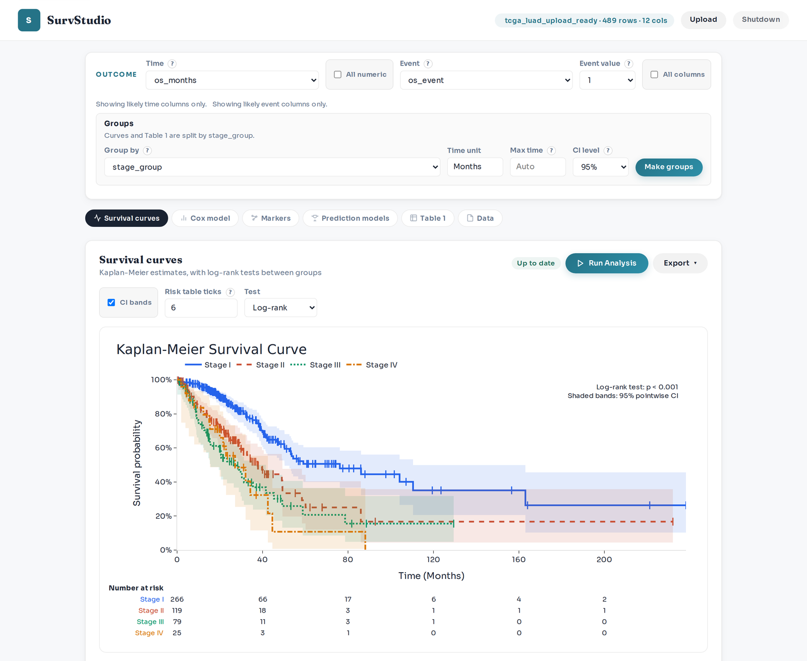

## What you can do

- **Survival curves.** Draw Kaplan-Meier curves for groups of patients (for example by stage or treatment), test
  whether the groups differ, and read the median survival and the numbers at risk.
- **Cox model.** See how each factor (age, sex, stage, a marker) changes the risk of the event, as hazard ratios
  with confidence intervals, with checks of the model's assumptions.
- **Table 1.** Describe your patients, overall or by group, in a table ready for a paper.
- **Candidate markers.** Check up to 60,000 candidate markers (for example gene expression) against clinical
  factors such as age and stage: multiplicity-adjusted tests are reported across all markers, stability is checked on
  resampled patients, and the model is locked and validated in another cohort.
- **Prediction models.** Compare Cox, penalized Cox, random survival forests, gradient boosting and deep-learning
  models fairly: all are trained and tested on the same patients, and the differences come with intervals.
- **Exports.** Save figures (PNG, SVG), tables (CSV, Excel, Word), and REMARK and TRIPOD+AI reporting checklists
  already filled in with your run.

## Install

The first install takes a few minutes and needs an internet connection. You do not need Python or git: a small
installer called [uv](https://docs.astral.sh/uv/) fetches everything SurvStudio needs and keeps it apart from the
rest of your computer.

**Windows**

1. Open PowerShell: press the Windows key, type `PowerShell` and press Enter.
2. Install uv. Copy this line, paste it into PowerShell (Ctrl+V or right-click) and press Enter:

   ```powershell
   powershell -ExecutionPolicy ByPass -c "irm https://astral.sh/uv/install.ps1 | iex"
   ```

   If you prefer winget: `winget install --id=astral-sh.uv -e`.
3. Close PowerShell and open it again, so that it finds `uv`.
4. Install SurvStudio:

   ```powershell
   uv tool install --python 3.12 "survstudio[all] @ https://github.com/kangk1204/SurvStudio/archive/refs/heads/main.zip"
   ```

**macOS**

1. Open Terminal (Finder, Applications, Utilities, Terminal).
2. On a Mac with Apple silicon (M1 or later), install Apple's free command-line tools, which one small part of
   SurvStudio needs. Run the line below and click Install; if it says the tools are already installed, go on.

   ```bash
   xcode-select --install
   ```

3. Install uv (or use `brew install uv`):

   ```bash
   curl -LsSf https://astral.sh/uv/install.sh | sh
   ```

4. Close Terminal and open it again.
5. Install SurvStudio:

   ```bash
   uv tool install --python 3.12 "survstudio[all] @ https://github.com/kangk1204/SurvStudio/archive/refs/heads/main.zip"
   ```

**Linux**

1. Install uv with `curl -LsSf https://astral.sh/uv/install.sh | sh` (or `brew install uv`).
2. Open a new terminal.
3. Run the same `uv tool install` command as for macOS. On an ARM computer, install a compiler first
   (`sudo apt install build-essential` on Ubuntu).

**Start SurvStudio.** In the terminal, type:

```bash
survstudio
```

Then open <http://127.0.0.1:8000> in your web browser. Keep the terminal window open while you work: SurvStudio
runs there. To stop it, press Ctrl+C in the terminal or click **Shutdown** at the top right of the page. To start
again, type `survstudio`.

**What `[all]` installs.** Everything: Excel and Parquet files, the machine-learning models (scikit-survival) and
the deep-learning models (PyTorch). The download is about 300 MB on Windows and macOS and about 3 GB on Linux, where
PyTorch comes with NVIDIA's GPU libraries; plan for 1 GB of disk space (6 GB on Linux). If you do not need deep
learning, the lighter install downloads about 200 MB and has everything else:

```bash
uv tool install --python 3.12 "survstudio[formats,ml] @ https://github.com/kangk1204/SurvStudio/archive/refs/heads/main.zip"
```

`--python 3.12` makes uv use Python 3.12, for which almost every part of SurvStudio comes ready-made (newer Python
versions would need a compiler). uv downloads it if needed and leaves any other Python on your computer alone.

**Update or remove.**

| To | Run |
|---|---|
| Update to the latest version | `uv tool upgrade survstudio` |
| Remove SurvStudio | `uv tool uninstall survstudio` |
| Also delete the downloaded files | `uv cache clean` |

**Other ways.** With [Docker](https://www.docker.com/): `docker build -t survstudio https://github.com/kangk1204/SurvStudio.git`,
then `docker run --rm -p 127.0.0.1:8000:8000 survstudio`. To work on the code, see the
[developer install](docs/reference.md#14-developer-install).

## Your first analysis in 10 minutes

This walkthrough uses a sample that comes with SurvStudio: 489 patients with lung adenocarcinoma from The Cancer
Genome Atlas (TCGA-LUAD), followed for overall survival.

**1. Open the sample.** On the start screen, click **Lung cancer (TCGA-LUAD)**. (For your own data, drop your file
on the left instead; see [Prepare your own data](#prepare-your-own-data).)

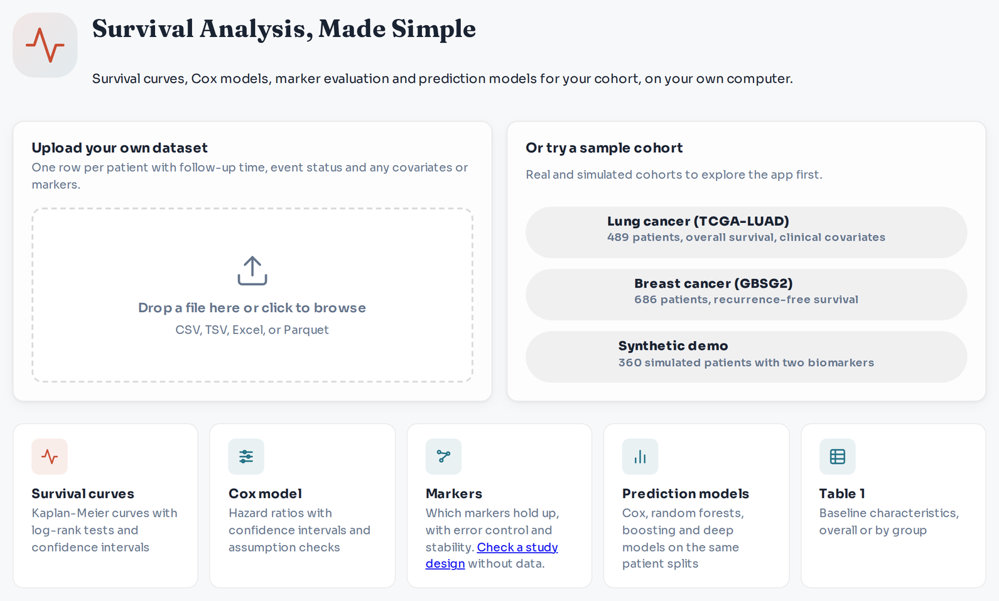

**2. Check the outcome.** The bar at the top says which columns hold the outcome. **Time** is `os_months`, the
months from diagnosis to death or last contact. **Event** is `os_event`, and **Event value** `1` means the patient
died; `0` means the patient was alive at last contact (censored). **Group by** is `stage_group`.

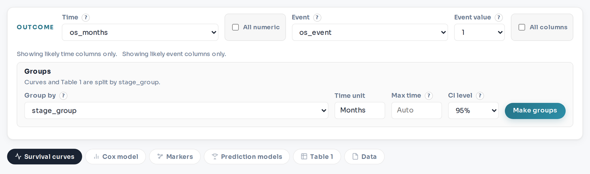

**3. Survival curves by stage.** On the **Survival curves** tab, click **Run Analysis**. Each line shows the share
of patients still alive over time; the shaded bands are 95% confidence intervals and the table under the plot
gives the numbers at risk. The log-rank test (p < 0.001) says the stages differ. The **KM Summary** table below
gives the median survival: 76 months in stage I, 38 in stage II, 27 in stages III and IV.

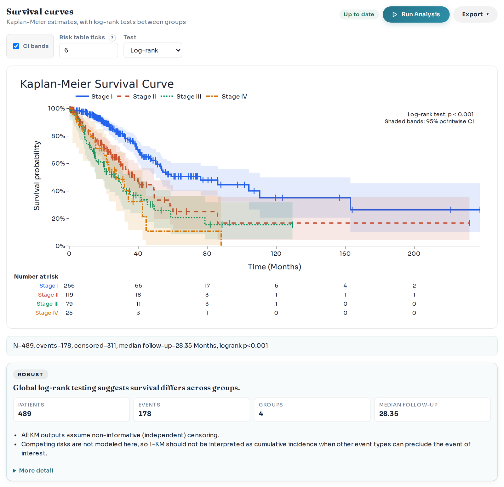

**4. Cox model.** Open the **Cox model** tab. Age, sex, stage and smoking status are ticked; click **Run Analysis**.
Each dot is a hazard ratio with its 95% interval: stage III patients died at about 3.3 times the rate of stage I
patients (95% CI 2.2 to 4.9) at the same age, sex and smoking status. The badge says **Caution** because one
smoking category has only 4 patients, so its estimate is unstable, and one term may break the model's
proportional-hazards assumption; the notes say which. Untick `smoking_status` and run again to see the difference.

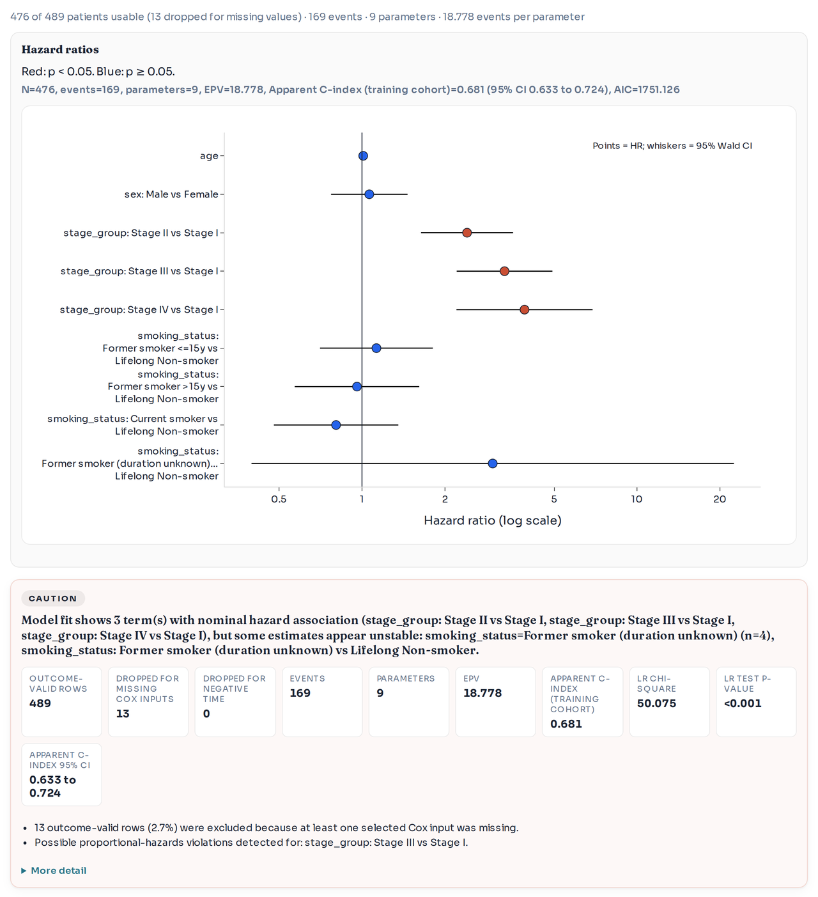

**5. Table 1.** Open **Table 1** and click **Build Table**. The table describes the patients overall and for each
stage. It is wide: scroll it sideways, or choose **Export → Table (Excel)** to open it in Excel.

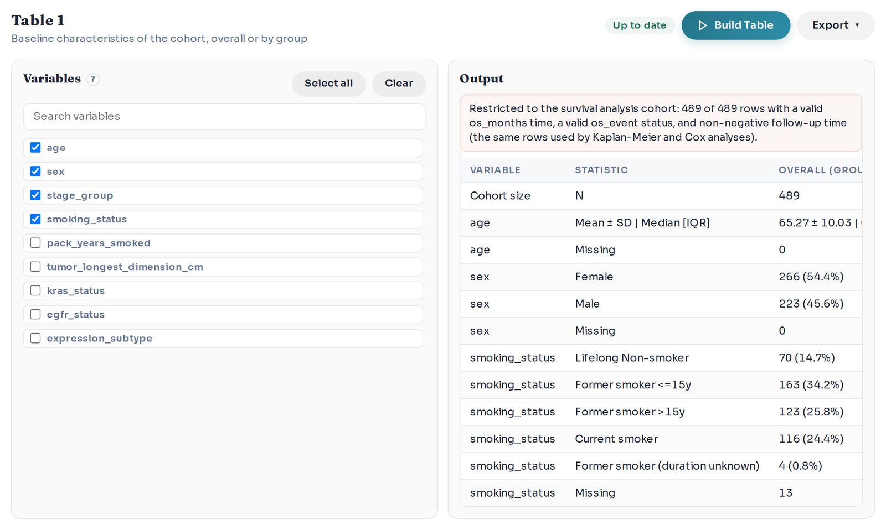

Every tab has an **Export** menu for its figures and tables, and a status next to **Run Analysis** tells you
whether the result still matches the settings.

## Check candidate markers

The **Markers** tab answers: which of my candidate markers predict survival beyond the clinical factors I already
know, and would they hold up in new patients? Here we test the 20,530 genes measured by RNA sequencing in the
TCGA-LUAD patients, adjusted for age, sex and stage.

**1. Get the gene expression file.** Download
[HiSeqV2.gz](https://tcga-xena-hub.s3.us-east-1.amazonaws.com/download/TCGA.LUAD.sampleMap%2FHiSeqV2.gz)
(31 MB) from the [UCSC Xena](https://xenabrowser.net/datapages/?dataset=TCGA.LUAD.sampleMap%2FHiSeqV2&host=https%3A%2F%2Ftcga.xenahubs.net)
TCGA hub. Keep it as downloaded; do not unzip it.

**2. Attach it.** With the lung cancer sample open, go to the **Markers** tab and open **Markers in a separate
file (omics)**. Leave **Patient ID column** at `patient_id`, choose `HiSeqV2.gz` and click **Attach**. SurvStudio
reports 20,530 markers and 484 of 489 patients matched: it matches the TCGA sample codes to the patients and
leaves normal tissue out.

**3. Choose the clinical covariates and run.** Under **Adjust for**, keep `age`, `sex` and `stage_group` ticked and
untick `smoking_status`. The line below the lists should read "20,530 markers from HiSeqV2.gz, judged on added
value over 3 clinical covariates". Keep the default settings (1,000 permutations and 200 subsamples, under
**More options**) and click **Run Analysis**. The run takes a few minutes (about 4 on an 8-core laptop).

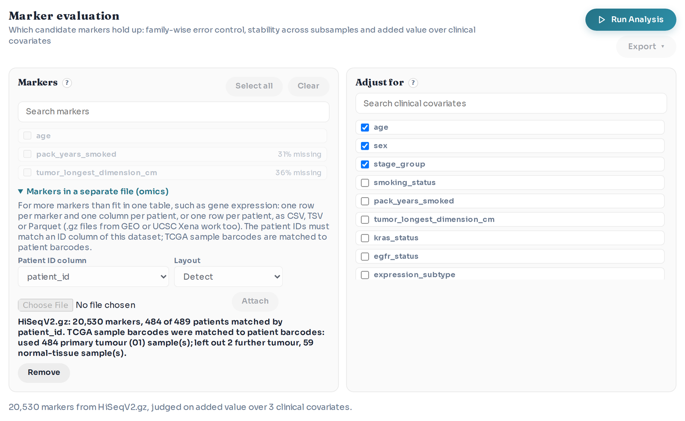

**4. Read the summary figure.** The left panel counts the markers that clear each bar, from the 20,530 supplied
and the 19,112 tested (genes expressed in very few patients are left out) down to those that pass every check.
3,404 genes have p < 0.05 and 306 pass the false discovery rate, but only 5 pass the family-wise test, which
keeps the chance of even one false positive among all 19,112 at 5%, and all 5 are stable enough to be robust.
The right panel shows the C-index of a model with the clinical covariates and the selected genes:

- **Apparent** (0.749): measured on the same patients the genes were chosen in. Always too optimistic.
- **Subsample gap-adjusted** (0.650): apparent C minus the mean training-to-left-out gap. This heuristic includes training-size effects and is not a Harrell bootstrap correction or a guarantee of performance in new patients.
- **Left-out patients** (0.658) against **Clinical only** (0.656): both measured in patients left out of each
  subsample. The note under the panel gives their difference, the gain, with its 95% interval: +0.002 (-0.042 to
  0.046). The interval is compatible with no gain and with a gain up to about 0.05; these data do not establish equivalence.

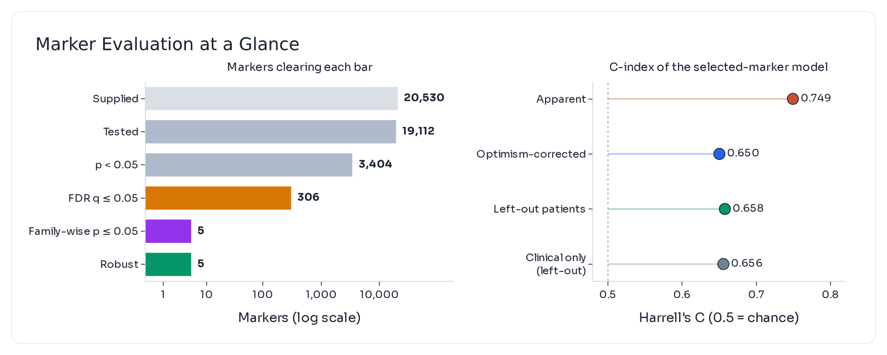

**5. Read the verdict.** The card below the figure gives the verdict and the cautions that matter most. Here it says
**Robust**: 5 of 19,112 genes (DKK1, NTSR1, TLE1, CTCFL and FAM117A) hold up beyond the clinical covariates. The
cautions add that the apparent C-index is optimistic by 0.099 and that the gain over the clinical covariates is
uncertain: its interval includes both no gain and a gain of 0.02 or more. SurvStudio calls the gain little only
when the whole interval lies below 0.02, and real when it lies above 0. **More detail** lists what was checked and
the next steps.

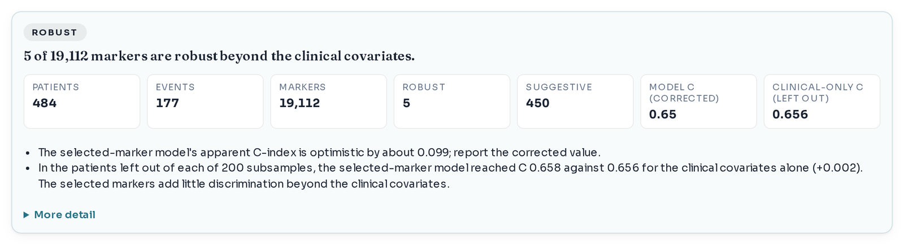

**6. See each marker.** The marker table lists the markers strongest first, with their tier, the direction of the
effect and the hazard ratio per unit, from a Cox model with the clinical covariates. Export it for all markers.

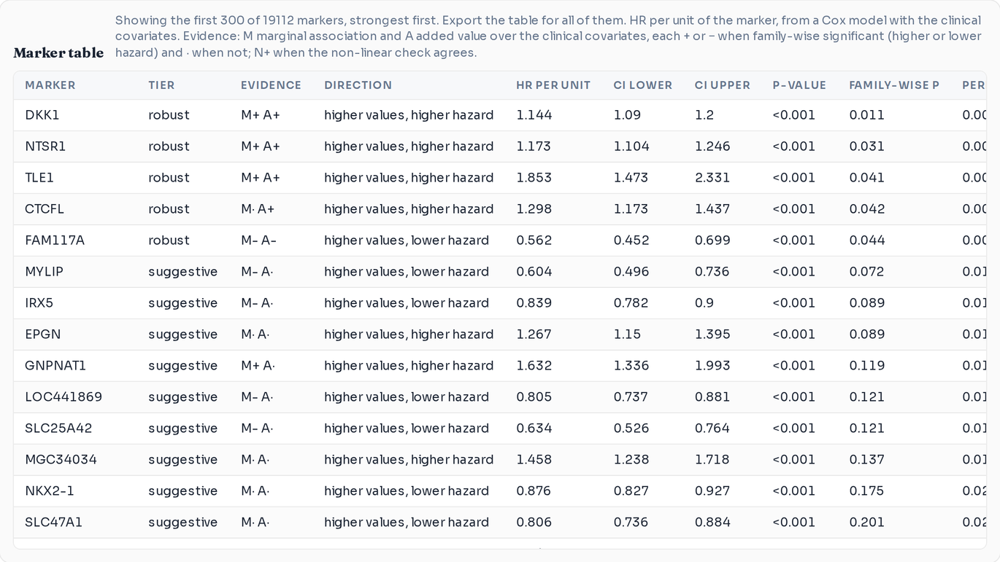

**7. Validate the locked model in another cohort.** SurvStudio locks the model (the genes, their weights and the
clinical part) so that it can be applied unchanged elsewhere. You need a table of a second cohort with the same
column names, one row per patient: here `os_months`, `os_event`, `age`, `sex`, `stage_group` and one column per
gene (genes it lacks are held at their typical value, and the report says how much of the model that leaves out).
The file used here is in the repository: [examples/gse68465_validation_example.csv](examples/gse68465_validation_example.csv).
Under **Validate in another cohort**, choose that file. For data measured on another platform (here microarrays
against RNA sequencing), choose **Another platform (rescale within cohort)**, then click **Validate**. The
screenshot shows 429 patients of the GEO cohort GSE68465: the locked model reached a C-index of 0.699 against 0.698
for the clinical covariates alone, so no added value, as step 4 predicted. Two of the six genes measured there
replicated (TLE1 and FAM117A).

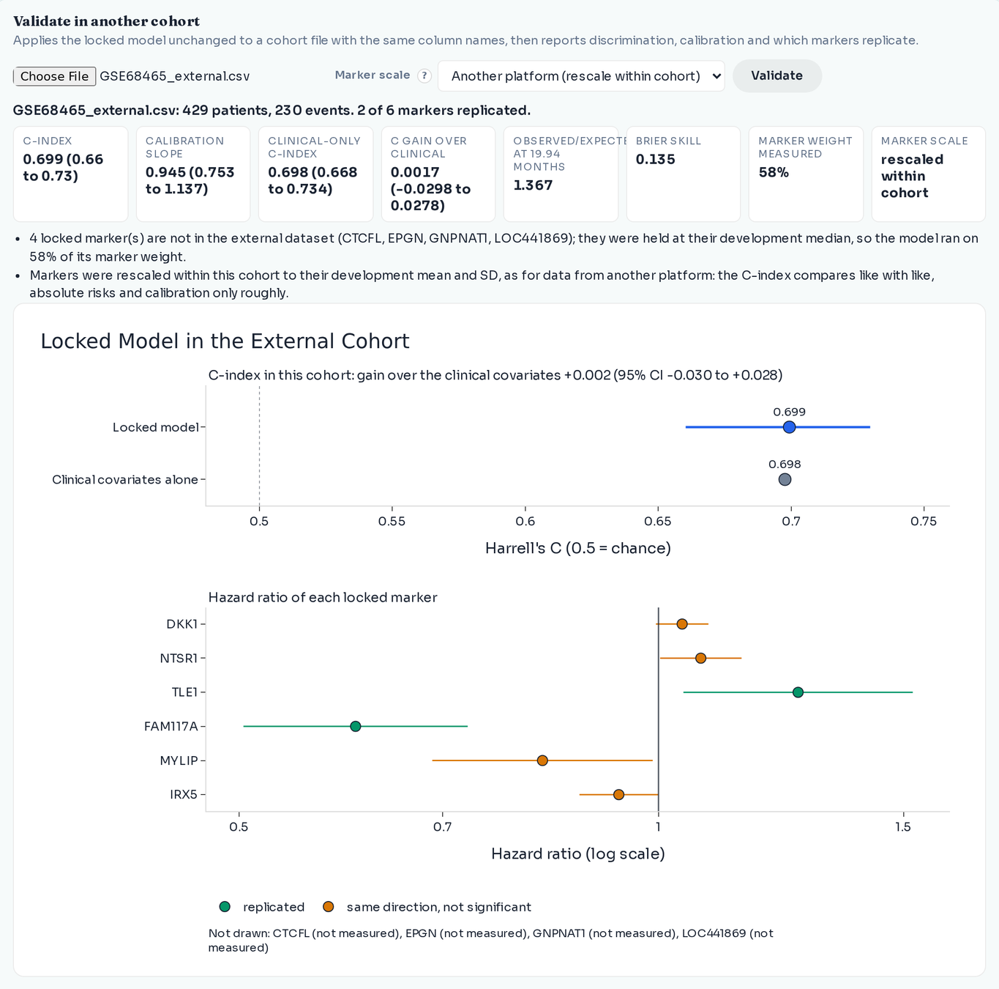

**8. Export for your paper.** The **Export** menu gives the marker table, the locked model (to validate later), the
figures, and the REMARK checklist as Word or Markdown. The checklist already holds the methods and results
paragraphs of your run and marks each of the 20 REMARK items as filled in by SurvStudio, partly filled in, or for
you to complete (for example how the specimens were stored).

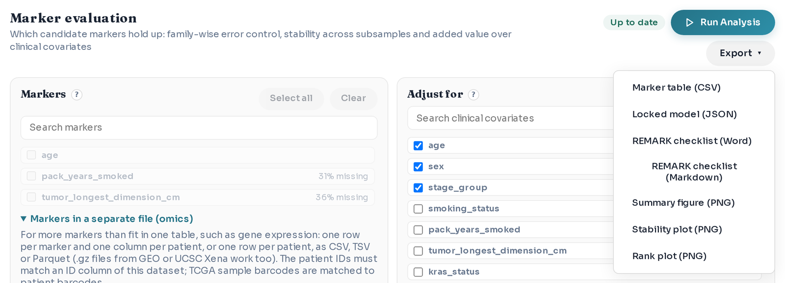

## Prepare your own data

SurvStudio reads one table: CSV, TSV, TXT, Excel (`.xlsx`, `.xls`) or Parquet. Make it like this:

- **One row per patient.** If a patient has several samples, keep one.
- **A follow-up time column.** Numbers only, in one unit for everybody (for example months), from the start point
  (diagnosis, surgery, randomisation) to the event or the last contact. If you have dates, compute it in Excel:
  `=(C2-B2)/30.44` gives months between the dates in B2 and C2.
- **An event column.** `1` if the event (for example death or relapse) happened, `0` if the patient was event-free
  at last contact. `yes`/`no` or `dead`/`alive` also work: choose the event value in the outcome bar.
- **Covariates.** Any other columns: numbers (age) or words (sex, stage, treatment). Leave unknown values empty.
- **One header row** with short column names, and no merged cells, notes or totals below the table.

| patient_id | os_months | os_event | age | sex | stage | treatment | marker_x |
|---|---|---|---|---|---|---|---|
| PT-001 | 12.4 | 1 | 67 | Female | III | Standard | 0.82 |
| PT-002 | 18.0 | 0 | 59 | Male | II | Combination | -0.15 |
| PT-003 | 7.2 | 1 | 72 | Female | IV | Standard | 1.31 |

In Excel, save with **File → Save As → CSV UTF-8**, or upload the `.xlsx` file itself.

**Many markers (omics).** Keep them in a separate file and attach it in the Markers tab: one row per marker
(first column: the marker names) and one column per patient (first row: the patient IDs, written exactly as in
your table's ID column), as GEO and UCSC Xena provide expression data. One row per patient with an ID column works
too. `.gz` files can be attached as downloaded.

**Common mistakes.**

- Text in the time column (`12 months`) or dates instead of a duration.
- An event column with three codes (`0` alive, `1` cancer death, `2` other death): recode it to one event first.
- The same patient in two rows, or the same tumour twice in a marker file (the Markers tab warns about this).
- A few words in a number column (`unknown` in `age`): leave those cells empty instead.
- A status that describes the patient at the start (`kras_status`, `egfr_status`) chosen as the event.

## How to read the results

- **Kaplan-Meier curve.** The share of patients still event-free over time. A step down is an event; a tick mark is
  a patient censored at that time. The **log-rank p-value** tests whether the curves differ; a small p-value does
  not by itself mean the difference matters clinically.
- **Hazard ratio (HR).** How much faster events happen in one group than in the reference group (or per unit of a
  number such as age), with the other covariates held equal. HR 2 means twice the rate, HR 0.5 half. If the 95%
  confidence interval (CI) includes 1, the data are compatible with no effect.
- **C-index.** How well a model ranks patients: for two patients, the chance that the one with the higher
  predicted risk has the event first. 0.5 is a coin toss and 1 is perfect. An apparent C-index, measured on the
  patients the model was built on, is too high; report honest internal estimates and externally validated values with their limitations.
- **Marker tiers.**
  - *Robust*: passes the family-wise test (p ≤ 0.05 after allowing for all markers tested), is selected in at least
    half of 200 random subsamples of the patients, and has the same direction in at least 90% of them.
  - *Suggestive*: some evidence (family-wise p ≤ 0.05 or false discovery rate ≤ 10%), but not stable across
    subsamples. A hypothesis for another cohort.
  - *Marginal only*: linked to survival on its own, but not beyond the clinical covariates; it mostly tracks them.
  - *Not supported*: no evidence after the error control. Small real effects can still hide here.
- **Added value over clinical covariates.** Whether a marker tells you something about survival that age, sex and
  stage do not already tell you. This is the test that matters for a prognostic claim. SurvStudio measures it as
  the gain in C-index over the clinical covariates in patients left out of the subsamples, with a 95% interval:
  little added value when the interval lies below 0.02, added value when it lies above 0, uncertain otherwise.
- **Cautions and "Needs review".** Cautions list what weakens the result (optimism, little added value, missing
  data, repeated patients). The verdict reads **Needs review** when no marker is robust or when two samples look
  like the same patient; then treat the markers as hypotheses, or keep one sample per patient and run again.

Sentences that report these results without overclaiming:

> Overall survival differed by stage (log-rank p < 0.001); median survival was 76 months in stage I and 38 months
> in stage II.

> After adjustment for age, sex and smoking status, stage III was associated with a higher hazard of death than
> stage I (HR 3.30, 95% CI 2.21 to 4.92).

> Of 19,112 genes, five passed family-wise error control and were stable across 200 subsamples. A model with the
> selected genes had a subsample gap-adjusted C-index of 0.650; in patients left out of the subsamples it reached
> 0.658, against 0.656 for age, sex and stage alone (gain 0.002, 95% CI -0.042 to 0.046), so the genes added no
> clear prognostic information beyond these factors.

## Troubleshooting

- **`uv` or `survstudio` is not recognized / command not found.** Open a new terminal window. If it is still not
  found, run `uv tool update-shell` (for `survstudio`) and open a new window again.
- **Port 8000 is busy** ("address already in use"). SurvStudio may already be running in another window; use that
  one, or start a second copy on another port with `survstudio serve --port 8001` and open
  <http://127.0.0.1:8001>.
- **The page does not load.** SurvStudio runs only while its terminal window is open; start it again with
  `survstudio`.
- **The file is refused.** The message says why. Check the columns: one header row, a numeric time column and an
  event column with two values. `survstudio inspect yourfile.csv` prints what SurvStudio sees in a file.
- **A message says a package is missing** (for example PyTorch). Install again with `[all]` in the command.
- **Deep-learning models are slow.** They run on the processor. Start with **Train one model**, the holdout
  evaluation and 100 epochs before **Compare All Models**, which trains every model in turn.
- **Where do my data go?** Nowhere. SurvStudio reads your file on your computer and keeps it in memory while it
  runs; the page talks only to the SurvStudio program in your terminal (127.0.0.1 means this computer). Stopping
  SurvStudio discards the data.

## Learn more

- [Reference manual](docs/reference.md): all install options, input limits, every analysis in detail, exports,
  the command line and the tests.
- [Numerical agreement](docs/validation/numerical_agreement.md) with R `survival`, lifelines and scikit-survival.
- How to cite: see [CITATION.cff](CITATION.cff), or **Cite this repository** on the GitHub page.
- Licence: [MIT](LICENSE).
- Changes: [RELEASE_NOTES.md](RELEASE_NOTES.md).

The marker residual permutation assumes exchangeable residuals after linear adjustment for the clinical covariates. Nonlinear or heteroscedastic relations and censoring assumptions require sensitivity checks; a family-wise adjusted p-value does not establish universal error control. The internal gain interval is the approximate corrected resampled t interval, whose survival-specific coverage is assessed by the paper's simulation.
