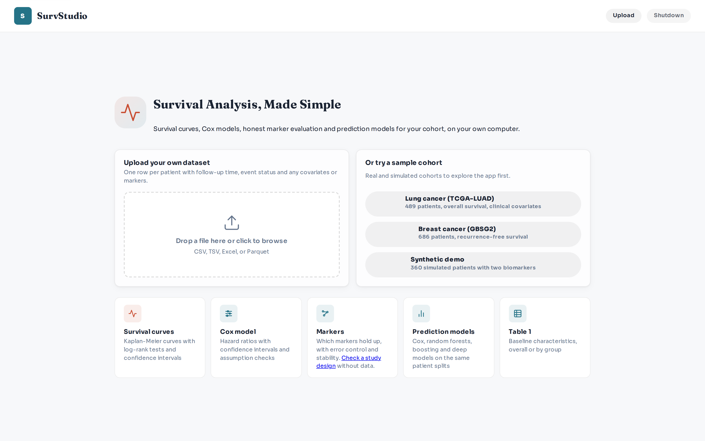

# SurvStudio

**Survival curves, risk factors and ML/DL model comparison in your browser.**
Upload a patient table or choose a sample, run an analysis, and save the results.
A local installation keeps your data on your computer.



[See all screenshots](docs/screenshots.md) · [User guide](docs/user-guide.md)

## 1. Install

Install [uv](https://docs.astral.sh/uv/getting-started/installation/) once; it also downloads Python for you.

<details>
<summary><strong>Windows — open PowerShell</strong></summary>

```powershell
powershell -ExecutionPolicy ByPass -c "irm https://astral.sh/uv/install.ps1 | iex"
```

Close PowerShell and open it again.

</details>

<details>
<summary><strong>macOS / Linux — open Terminal</strong></summary>

```bash
curl -LsSf https://astral.sh/uv/install.sh | sh
```

Close Terminal and open it again. On an Apple silicon Mac, install Apple's command-line tools with
`xcode-select --install` if they are not already installed.

</details>

Then install SurvStudio, including ML/DL models:

```bash
uv tool install --python 3.12 "survstudio[all] @ https://github.com/kangk1204/SurvStudio/archive/refs/heads/main.zip"
```

[Other install options and troubleshooting](docs/installation.md)

## 2. Run

```bash
survstudio
```

Open **http://127.0.0.1:8000**. Keep the terminal open while using the app; press **Ctrl+C** to stop.
Choose **Synthetic demo** to try it first. For your own file, use one row per patient and include
follow-up time and an event column (`1` = event, `0` = censored).

## 3. Choose a mode

| Mode | What it does | What you get |
|---|---|---|
| **Survival curves** | Compare survival between groups | Kaplan–Meier curves, median survival, log-rank test |
| **Cox model** | Examine risk factors together | Hazard ratios, confidence intervals, model checks |
| **Prediction models — ML** | Learn and compare risk predictions | Cox baseline, LASSO-Cox, survival forests and boosting; held-out C-index |
| **Prediction models — DL** | Evaluate neural survival models | DeepSurv, DeepHit, MTLR; Transformer/VAE are experimental |
| **Markers** | Evaluate candidate markers beyond clinical factors | Adjusted evidence, stability and analysis status |
| **Table 1** | Describe the patients | Overall or grouped summary table |

Choose **Export** in a result tab to save its figures or tables.
[Mode settings and how to read results](docs/user-guide.md#main-analyses)

## 4. Try the test data

Click a sample on the start screen, or download a CSV below and upload it.

| Sample | Patients | Time / event columns | Try grouping by |
|---|---:|---|---|
| [Synthetic demo](examples/synthetic_demo.csv) | 360 | `os_months` / `os_event` | `stage` |
| [Lung cancer — TCGA-LUAD](examples/tcga_luad_nature2014_upload_ready.csv) | 489 | `os_months` / `os_event` | `stage_group` |
| [Breast cancer — GBSG2](examples/gbsg2_jco1994_upload_ready.csv) | 686 | `rfs_days` / `rfs_event` | `horTh` |

Set **Event value = 1**, open **Survival curves**, and click **Run Analysis**.
The result includes a curve, a risk table and group summaries.

**Example results:** TCGA-LUAD median survival is about **76, 38, 27 and 27 months** for stages I–IV.
GBSG2 median recurrence-free survival is **1,528 days** without hormone therapy and **2,018 days** with it.
In one GBSG2 holdout run (seed 42), C-index was **0.688 for RSF** and **0.677 for DeepSurv**.
These are sample outputs, not evidence that a treatment causes a difference or that one prediction model is best.

[Exact settings and KM / Cox / ML / DL outputs](examples/results.md) · [Data sources and larger example files](examples/README.md)

## More help

[Installation](docs/installation.md) · [User guide](docs/user-guide.md) ·
[Numerical checks](docs/validation/numerical_agreement.md) · [Changes](RELEASE_NOTES.md) · [MIT license](LICENSE)
