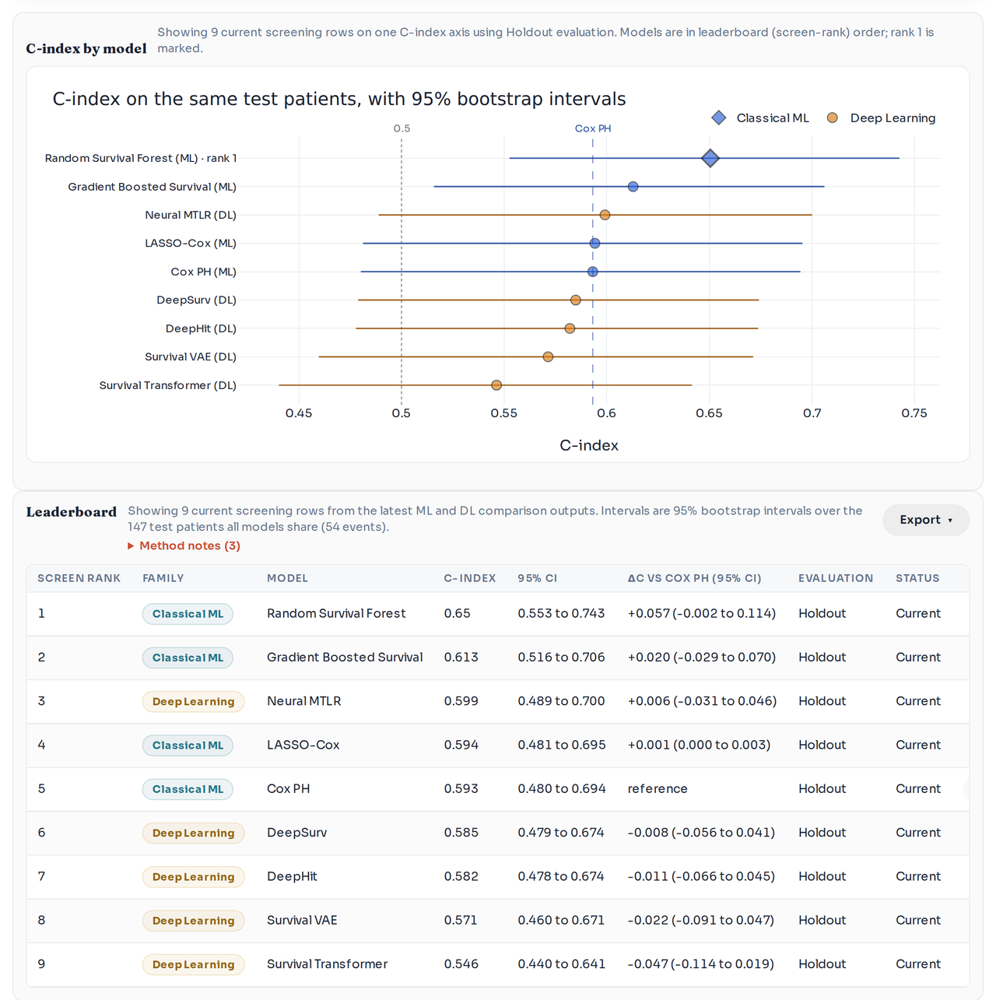

# SurvStudio reference manual

This manual holds the technical detail behind the [README](../README.md): every way to install and run SurvStudio,
the input format and its limits, what each analysis computes, how to read the results, the exports, and how the
software is tested. Start with the README if you are new; come here when you need the detail.

Contents

1. [Install](#1-install)
2. [Run](#2-run)
3. [Sample data](#3-sample-data)
4. [Input data](#4-input-data)
5. [Input checks and error messages](#5-input-checks-and-error-messages)
6. [Analyses](#6-analyses)
7. [Reading the results](#7-reading-the-results)
8. [Export](#8-export)
9. [Evaluation contract for prediction models](#9-evaluation-contract-for-prediction-models)
10. [Command line](#10-command-line)
11. [Deep-learning run time](#11-deep-learning-run-time)
12. [Scope and limitations](#12-scope-and-limitations)
13. [Development and testing](#13-development-and-testing)
14. [Release notes, citation and licence](#14-release-notes-citation-and-licence)

## 1. Install

### 1.1 Recommended: uv

The README installs SurvStudio with [uv](https://docs.astral.sh/uv/), which downloads its own Python and keeps
SurvStudio in a separate environment, so neither Python nor git has to be installed first:

| System | Install uv | Alternative |
|---|---|---|
| Windows (PowerShell) | `powershell -ExecutionPolicy ByPass -c "irm https://astral.sh/uv/install.ps1 \| iex"` | `winget install --id=astral-sh.uv -e` |
| macOS, Linux | `curl -LsSf https://astral.sh/uv/install.sh \| sh` | `brew install uv` |

Then, in a new terminal window:

```bash
uv tool install --python 3.12 "survstudio[all] @ https://github.com/kangk1204/SurvStudio/archive/refs/heads/main.zip"
survstudio
```

and open <http://127.0.0.1:8000>.

- The URL is the current `main` branch of the GitHub repository as a zip file, so no git is needed.
- `--python 3.12` makes uv use Python 3.12, downloading it if needed. For Python 3.12, PyPI has ready-made
  packages (wheels) of nearly every dependency on Windows, macOS and Linux (the exceptions follow). The newest
  Python releases lack more of them (the `ecos` solver that scikit-survival needs has no wheels for Python 3.13 or
  later), and building them needs a compiler.
- Some platforms still compile a small part during the install:
  - Macs with Apple silicon compile `ecos`, which needs Apple's command-line developer tools
    (`xcode-select --install`, once).
  - Linux on ARM compiles `ecos` and scikit-survival, which needs a C and C++ compiler
    (`sudo apt install build-essential` on Ubuntu).
  - Windows on ARM needs nothing extra: uv installs the x64 build of Python, which runs under emulation, and uses
    the x64 packages.
- uv puts the program in its tool folder (`uv tool dir`) and the `survstudio` command in its executable folder
  (`uv tool dir --bin`), which the uv installer adds to your PATH. Downloads are cached (`uv cache dir`).

Update, remove:

| Task | Command |
|---|---|
| Update to the current `main` | `uv tool upgrade survstudio` |
| Remove SurvStudio | `uv tool uninstall survstudio` |
| Delete uv's download cache | `uv cache clean` |
| Remove uv itself | see [uv's uninstall instructions](https://docs.astral.sh/uv/getting-started/installation/#uninstallation) |

`uv tool upgrade` asks GitHub whether the zip file changed since the install and, if it did, installs the new
version with the same options.

### 1.2 Optional parts (extras)

The part in square brackets after `survstudio` chooses optional parts:

| Install | Adds | What it enables |
|---|---|---|
| `survstudio` | the app and its core packages | CSV, TSV and TXT files; survival curves, Cox model, Table 1, marker evaluation, design check |
| `survstudio[formats]` | openpyxl, pyarrow, xlrd | Excel (`.xlsx`, `.xls`) and Parquet uploads, Parquet marker files, Table 1 as Excel |
| `survstudio[ml]` | scikit-learn, scikit-survival, shap | LASSO-Cox, random survival forest, gradient boosting, SHAP, the Markers tab's non-linear check |
| `survstudio[dl]` | PyTorch, scikit-learn | the deep-learning models (DeepSurv, DeepHit, Neural MTLR, Survival Transformer, Survival VAE) |
| `survstudio[all]` | `formats`, `ml`, `dl` and kaleido | everything above |
| `survstudio[dev]` | pytest, httpx and the runtime extras | running the test suite |
| `survstudio[e2e]` | Playwright | the browser end-to-end test |
| `survstudio[validation]` | lifelines, scikit-survival | regenerating the numerical agreement report |

Figures are saved as PNG or SVG by the browser itself, and Word files (checklists, report tables) are written
by SurvStudio, so neither needs an extra. kaleido (in `all` and `dev`) is only for saving Plotly figures from
Python code (`figure.write_image`); kaleido 1.x also needs a Chrome or Chromium browser (`plotly_get_chrome`
downloads one).

`survstudio[formats,ml]` is everything except deep learning: without PyTorch, the deep-learning models report that
PyTorch is not installed, and everything else works as usual.

Download sizes with Python 3.12, resolved against PyPI on 2026-09-29 (wheels and source files of every package):

| Install | Windows (x64) | macOS (Apple silicon) | Linux (x64) | Linux (ARM64) |
|---|---|---|---|---|
| `survstudio` | 86 MB | 79 MB | 101 MB | 97 MB |
| `survstudio[formats,ml]` | 170 MB | 170 MB | 237 MB | 227 MB |
| `survstudio[all]` | 304 MB | 261 MB | 3.2 GB | 3.4 GB |

PyTorch for Linux comes with NVIDIA's GPU libraries, hence the 3 GB. Installed, `[all]` took 1.0 GB on Windows and
5.8 GB on Linux (ARM64) in our tests, and `[formats,ml]` 0.5 GB and 0.75 GB. On a Linux computer without an NVIDIA
GPU, PyTorch's CPU-only build is much smaller (in our test a 150 MB download, 1.4 GB installed in all); add
PyTorch's CPU package index to the install command:

```bash
uv tool install --python 3.12 --index https://download.pytorch.org/whl/cpu --index-strategy unsafe-best-match \
  "survstudio[all] @ https://github.com/kangk1204/SurvStudio/archive/refs/heads/main.zip"
```

### 1.3 Docker

To run SurvStudio in a container, build the image from the repository's address and run it:

```bash
docker build -t survstudio https://github.com/kangk1204/SurvStudio.git
docker run --rm -p 127.0.0.1:8000:8000 survstudio
```

Then open <http://localhost:8000>. From a clone of the repository, `docker build -t survstudio .` does the same.

- Publish the port on `127.0.0.1` as shown. Inside the container the server listens on every interface and it
  has no login, so `-p 8000:8000` would expose it to your network.
- The image includes the table formats and the classical ML models. Build with `--build-arg EXTRAS=all` to add
  deep learning (PyTorch, about 1 GB more).
- Uploaded data stay in the container's memory and are gone when it stops.
- The in-app `Shutdown` button does not work through Docker's port forwarding; stop the container with
  `docker stop` or Ctrl+C.

### 1.4 Developer install

For working on the code, clone the repository and install it in editable mode with the test tools. You need
Python 3.11 or newer and internet access for the first install.

On macOS or Linux:

```bash
git clone https://github.com/kangk1204/SurvStudio.git
cd SurvStudio
python3 -m venv .venv
source .venv/bin/activate
pip install -e ".[dev]"
survstudio
```

On Windows (PowerShell), calling the environment's Python directly avoids PowerShell's script-activation policy:

```powershell
git clone https://github.com/kangk1204/SurvStudio.git
cd SurvStudio
py -3.11 -m venv .venv
.\.venv\Scripts\python.exe -m pip install -e ".[dev]"
.\.venv\Scripts\python.exe -m survival_toolkit
```

Notes:

- Use the `pip` that comes with the new virtual environment. If you upgraded `pip` separately and the editable
  install failed, recreate `.venv` and retry without the upgrade.
- Before you start, leave any active environment (`deactivate`, `conda deactivate`). After activation,
  `which python` should point to `.venv/bin/python`.
- `pip install -e .` installs the app without optional parts; add extras as in section 1.2, for example
  `pip install -e ".[all]"`.
- On Ubuntu, install Python 3.11 with `sudo apt install -y python3.11 python3.11-venv python3-pip build-essential git`
  and create the environment with `python3.11 -m venv .venv`. On Ubuntu 22.04, `python3` is often still 3.10.
- On a Mac, `brew install python@3.11` provides Python 3.11 (`python3.11 -m venv .venv`).
- In WSL, keep the repository on the Linux file system (for example `~/projects/SurvStudio`), not under
  `/mnt/c/...`; the editable install can stall on mounted Windows paths.

If your system Python is 3.10 or older and you have Conda or Micromamba (Ubuntu 22.04, shared servers without
`sudo`, WSL), bootstrap a project-local Python 3.11 first:

```bash
git clone https://github.com/kangk1204/SurvStudio.git
cd SurvStudio
conda create -y -p .conda python=3.11 pip
./.conda/bin/python -m venv .venv
source .venv/bin/activate
pip install -e ".[dev]"
```

or run from the Conda environment directly: `conda run -p ./.conda python -m pip install -e .` and
`conda run -p ./.conda python -m survival_toolkit`.

For the browser end-to-end test, add the `e2e` extra and a Chromium for Playwright:

```bash
pip install -e ".[dev,e2e]"
python -m playwright install chromium          # or: --with-deps chromium on a fresh Linux machine
```

### 1.5 Installation notes

- On Linux, the `dl`, `dev` and `all` extras download a large PyTorch wheel with NVIDIA runtime packages (see
  section 1.2).
- On Linux, PyTorch may print a CUDA initialization warning when the NVIDIA driver is older than the wheel expects.
  SurvStudio still runs on the CPU, so the warning matters only if you need GPU acceleration.
- SurvStudio is written for pandas copy-on-write, the only mode in pandas 3. With pandas 2.x,
  `import survival_toolkit` switches copy-on-write on for the whole Python session, so chained assignment
  (`df["a"][0] = 1`) in your own code no longer changes `df`; use pandas 3, or a separate session, if your code
  relies on it.
- The app itself does not need Playwright.

## 2. Run

`survstudio` starts the server on <http://127.0.0.1:8000>; open that address in your browser. The same program
runs as `survstudio serve`, as `survival-toolkit` (the older name) and, in a developer install, as
`python -m survival_toolkit`.

| Option | Meaning |
|---|---|
| `survstudio serve --port 8001` | use another port, for example when 8000 is taken |
| `survstudio serve --host 0.0.0.0` | listen on every network interface (see the security notes below) |
| `survstudio serve --allowed-host NAME` | also answer requests addressed to `NAME` (repeatable) |
| `survstudio serve --reload` | restart when the code changes (development) |
| `survstudio inspect FILE` | print a profile of a data file without starting the server (section 10) |

The app opens on the start screen. After loading a cohort, set the outcome in the bar at the top and pick a tab.
The design check for studies that fit many models and keep the best is at <http://127.0.0.1:8000/design-check>
and needs no data.

Local-only request guard:

- The server answers only requests addressed to `localhost`, `127.x.x.x`, `[::1]` or the `--host` bind address,
  and refuses state-changing requests (uploads, analyses, shutdown) sent from other websites.
- To reach it through another name (a LAN host name or a reverse proxy), allow that name:
  `survstudio serve --host 0.0.0.0 --allowed-host my-workstation.local`, or set
  `SURVSTUDIO_ALLOWED_HOSTS=my-workstation.local` (comma-separated; `*` disables the Host check) when you start
  `uvicorn` directly.

Security and runtime behaviour:

- SurvStudio has **no login**. Keep the default `127.0.0.1` bind address unless every machine that can reach the
  server is trusted; `serve --host 0.0.0.0` prints a warning, because anyone who can reach the address can upload
  data, run analyses and open datasets whose IDs they know.
- The in-app `Shutdown` works only when the page was opened through a loopback address; through a LAN name or a
  reverse proxy it returns `403`.
- Uploaded datasets live in memory only: at most 10 at a time (the least recently used is dropped first), and each
  expires after 1 hour without use. A file is written to a temporary file while it is read and deleted right after.
  `DELETE /api/dataset/{dataset_id}` frees a dataset at once, together with any models cached for it.
- Heavy jobs (model training and comparison, marker evaluation, signature search, optimal cutpoints,
  time-dependent importance, counterfactual and partial-dependence runs) run at most 2 at a time; later ones wait
  for a free slot. Set `SURVSTUDIO_MAX_HEAVY_JOBS` to change the limit.
- When the page abandons a request (you start a newer run of the same kind, or close the tab), the server stops
  that job at its next checkpoint instead of finishing work nobody will read.

## 3. Sample data

The start screen offers three sample cohorts. Each opens with its recommended outcome, grouping and variable
selections.

| Sample | Patients | Outcome | Notes |
|---|---|---|---|
| Lung cancer (TCGA-LUAD) | 489 | overall survival, `os_months` / `os_event` | clinical covariates from TCGA; used by the README walkthrough |
| Breast cancer (GBSG2) | 686 | recurrence-free survival, `rfs_days` / `rfs_event` | no missing values; a fast end-to-end test |
| Synthetic demo | 360 | `os_months` / `os_event` and `pfs_months` / `pfs_event` | generated in the package; demographic, treatment and stage variables and two biomarkers |

The fuller UCSC Xena TCGA-LUAD table is available from the API (`POST /api/load-tcga-example`).

Provenance:

- The bundled TCGA-LUAD tables are curated from UCSC Xena / TCGA for survival-workflow demonstration; the
  lung-cancer sample and the RNA top-100 and top-500 upload files are compact derivatives of that public dataset.
- The breast-cancer sample is the public GBSG2 recurrence cohort (Schumacher et al., J Clin Oncol 1994).
- Study citations and file-level notes are in [examples/README.md](../examples/README.md). Follow the original
  data source's citation and reuse terms when you redistribute derived outputs.

Upload-ready copies, for trying the upload itself:

- [examples/tcga_luad_nature2014_upload_ready.csv](../examples/tcga_luad_nature2014_upload_ready.csv)
- [examples/tcga_luad_rnaseq_top100_upload.csv](../examples/tcga_luad_rnaseq_top100_upload.csv)
- [examples/tcga_luad_rnaseq_top500_upload.csv](../examples/tcga_luad_rnaseq_top500_upload.csv)
- [examples/gbsg2_jco1994_upload_ready.csv](../examples/gbsg2_jco1994_upload_ready.csv)

Recommended settings for each sample:

| | TCGA-LUAD | GBSG2 | Synthetic demo |
|---|---|---|---|
| Time, event, event value | `os_months`, `os_event`, `1` | `rfs_days`, `rfs_event`, `1` | `os_months`, `os_event`, `1` |
| Group by | `stage_group` | `horTh` (also `menostat`) | `stage` or `treatment` |
| Cox covariates | `age`, `sex`, `stage_group`, `smoking_status` | `age`, `horTh`, `menostat`, `pnodes`, `tgrade`, `tsize` | `age`, `sex`, `stage`, `treatment`, `biomarker_score`, `immune_index` |
| Categorical | `sex`, `stage_group`, `smoking_status` | `horTh`, `menostat`, `tgrade` | `sex`, `stage`, `treatment` |
| Prediction-model features | as the Cox covariates | as the Cox covariates | as the Cox covariates |

For the synthetic demo, the Markers tab evaluates `biomarker_score` and `immune_index` adjusted for `age`, `sex`,
`stage` and `treatment`. That dataset has no `stage_group` or `treatment_group` columns; the names are `stage` and
`treatment`.

Useful first outputs: a Kaplan-Meier plot by stage or treatment group, a Cox hazard-ratio forest plot, Table 1 by
group, and a model comparison table (repeated cross-validation with a locked test set for a report).

## 4. Input data

### 4.1 Files

| File type | Needs |
|---|---|
| `csv`, `tsv`, `txt` | nothing extra |
| `xlsx`, `xls`, `parquet` | the `formats` extra (section 1.2) |

Prefer `.xlsx` over the old `.xls`. Other extensions are refused before anything is written to disk.

Limits and encodings:

- At most 200 MB per file, 100,000 rows, 5,000 columns and 5,000,000 cells; `.xlsx` workbooks may expand to at
  most 256 MB when unpacked. Text and Excel files over a limit are refused from their header and a bounded read,
  before the whole file is parsed.
- Up to 1,000 columns can be model features. Wider omics data go into the Markers tab as a separate marker file
  (section 6.5).
- Text files may be UTF-8 (with or without BOM), UTF-16, Korean CP949/EUC-KR (what Korean Excel saves as "CSV"),
  Windows-1252 or Latin-1. The encoding is detected automatically; the upload banner and the
  `survstudio inspect` profile (`text_encoding`) show which one was used.

### 4.2 Structure

- One row per patient or subject, and one survival endpoint at a time.
- One column for the follow-up time, one for the event status, and the remaining columns as covariates.
- Do not upload long-format tables (several rows per patient across visits, one row per time point or per lesion).

A minimal example:

```csv
patient_id,os_months,os_event,age,stage,treatment,biomarker_score
PT-001,12.4,1,67,III,Standard,0.82
PT-002,18.0,0,59,II,Combination,-0.15
PT-003,7.2,1,72,IV,Standard,1.31
```

`os_months` is the follow-up time; `os_event = 1` means the event happened and `os_event = 0` that the patient was
censored (event-free at last contact).

A good first template: `patient_id`, `os_months`, `os_event`, `age`, `sex`, `stage`, `treatment`, and one or more
biomarker columns.

### 4.3 Time

The time column must be numeric, in one unit for every row (months from diagnosis to death, days from surgery to
recurrence, weeks from enrolment to progression), and zero or positive. Time 0 is kept; negative times are
dropped. Do not mix units (some rows in days, others in months), and do not use text such as `12 months` or
dates: compute the follow-up duration first.

### 4.4 Event coding

- The event column must be a **binary** indicator. The default is `1 = event`, `0 = censored`; for another coding
  (`yes / no`, `death / alive`, `R / N`) choose the event value in the outcome bar.
- The Event menu lists only binary columns whose names look like event indicators. If your indicator has another
  name, tick `All columns`.
- A status column with more than two states must be recoded first, for example
  `0 = censored, 1 = cancer death, 2 = non-cancer death` or `0 = no event, 1 = relapse, 2 = death`. These are not
  single-event outcomes.
- Baseline characteristics such as `egfr_status`, `kras_status`, `sex`, `stage` or treatment labels are not event
  columns; use them as groups or covariates.

### 4.5 Missing values and variable types

Rows become unusable, and are dropped from the analysis that needs them, when they have a missing time, a missing
event, a missing value in a selected covariate, or a non-numeric value in a numeric time column. Keep missing
values to a minimum in the variables you plan to model.

- Text columns (for example `stage` or `smoking_status`) are categorical in Cox, ML and deep models, whether or
  not you mark them categorical.
- A column that is numeric except for a few stray text values (for example `unknown` in `age`) is refused as a
  model feature in every module; leave those cells blank instead (blank means missing).
- A text column with more than 50 distinct values is refused as a feature unless you mark it categorical: it is
  usually numbers stored as text (values such as `<0.1`, or decimal commas) or a patient ID.
- A column you mark categorical is used as categorical even when its values look numeric.
- Numeric category codes are the same levels whether a column was read as whole numbers or decimals (`1` and
  `1.0`; one blank cell makes pandas read a code column as decimals), so a model locked on one cohort scores
  another cohort's codes correctly.
- The reference level of a categorical variable follows the clinical order (stage I before II, never smoker
  before current smoker) or numeric order for numeric-looking codes (`2` before `10`).

### 4.6 Common mistakes

- the event column has more than two outcome states
- the time column contains text such as `12 months`, or dates instead of a numeric duration
- one patient appears in several rows
- a categorical text field was chosen as the survival time column

## 5. Input checks and error messages

SurvStudio does not silently guess around invalid survival inputs. On upload and analysis it checks, among other
things:

- the file extension, the text encoding, and that the file is not empty
- the size limits and the 1,000-feature model-input cap
- that the chosen columns exist
- that the time is numeric and zero or positive
- that the event column is a binary indicator and holds the event value you chose
- that the selected covariates still leave analysable rows after missing values are removed

Expect an error when the event column cannot be read as binary or has more than two states, when the chosen event
value is not present, when you tick `All columns` and choose a baseline status field as the event, when the time
column has no positive values, when no rows remain after missing values are removed, or when a model has too few
patients or events. Examples of the messages:

- `Unsupported input file extension`
- `Could not infer event coding`
- `The numeric event column has more than two distinct states`
- `No analyzable rows remain after removing missing values`
- `No events were found after preprocessing the event column`
- `Survival outcome columns cannot be used for ...` (an outcome column chosen as a covariate or feature)

If an upload or analysis fails: check that the time column is numeric and the event column binary, that the event
value is right, that each patient appears once, and the missing values in the selected variables. Load a sample
cohort to confirm the app itself works, and run `survstudio inspect path/to/file.csv` to profile the file.

## 6. Analyses

### 6.1 Survival curves (Kaplan-Meier)

Kaplan-Meier curves by group with pointwise confidence bands (90, 95 or 99%), the numbers at risk under the time
axis at round times, median survival with its interval, restricted mean survival time (RMST) with delta-method
intervals at the display horizon, and log-rank tests: overall and pairwise with Benjamini-Hochberg adjustment,
with Gehan-Breslow, Tarone-Ware and Fleming-Harrington weights as alternatives.

### 6.2 Groups and cutpoints

`Groups → Make groups` derives a grouping column from a numeric variable:

- median, tertile and quartile splits
- `Percentile split`: `25` means at or above the 75th-percentile threshold against the rest; `25,25` means at or
  below the 25th percentile, between, and at or above the 75th percentile. Ties at a threshold can make the groups
  slightly larger than the nominal percentages.
- `Extreme split`: `25` means at or below the 25th percentile against at or above the 75th; the middle 50% is left
  out of grouped analyses of that column.
- `Optimal cutpoint (log-rank)`: the cutpoint that separates the survival curves best, with a permutation p-value
  that accounts for the search (min group fraction, permutation iterations and seed are adjustable).

Optimal cutpoints are exploratory. The chosen cutpoint is a fixed rule on the marker, so the derived column labels
every row with a usable marker value, including rows whose outcome is missing (they did not help choose the
cutpoint); the summary reports how many rows were scanned and how many were labelled without an outcome. On very
large cohorts the scan may use a quantile grid of candidate cutpoints; the result then carries a `candidate_grid`
note.

### 6.3 Cox model

Hazard ratios with confidence intervals and p-values for the chosen covariates, categorical covariates with a
reference level, and strata (variables with their own baseline hazard; they get no hazard ratio). Before fitting,
the tab previews the usable patients, dropped rows, parameters and events per parameter. The results include:

- the forest plot and hazard-ratio table
- the proportional-hazards check: Grambsch-Therneau score tests on scaled Schoenfeld residuals against log time,
  one test per model term and a global test (the classic `cox.zph` statistic of R `survival` before 3.0, also used
  by lifelines' `proportional_hazard_test` with a log transform), with a smoothed residual plot
- the linearity check: martingale residuals against each continuous covariate
- the apparent C-index with its interval, the likelihood-ratio test, AIC and BIC (BIC uses the number of events as
  the sample size, as R's `BIC(coxph)` does)

Estimates use the Efron method for tied event times. Schoenfeld and martingale residuals use the Efron correction
within each stratum, as R's `residuals.coxph` does, so the test and the plots stay correct with tied times, in
stratified and unstratified models alike. The badge above the key numbers reads Robust when only the standing
assumptions apply, Needs review when the data raise a caution (for example a possible proportional-hazards
violation), and Caution when an estimate is unstable (a category with very few patients, a missing reference
level, fewer than 5 events per parameter) or two or more terms fail the proportional-hazards check.

### 6.4 Table 1

Baseline characteristics of the analysed patients, overall or by the Group by variable: mean ± SD and median [IQR]
for numeric variables, counts and percentages for categories, and missing counts. The table is restricted to the
survival analysis cohort (rows with a valid time and event), the same rows Kaplan-Meier and Cox use. With a
grouping, `Overall` refers to the grouped, non-missing subset used in that table, not to all rows.

### 6.5 Marker evaluation (Markers tab)

Use this when you screen many candidate markers (for example gene-expression values) for association with
survival and want the claim checked the way a careful reviewer would check it. It runs in the Markers tab and from
Python.

**Markers.** Markers are numeric columns of the uploaded table or, for omics data, a separate marker file. Open
`Markers in a separate file (omics)`, choose the dataset's patient ID column and attach a CSV, TSV, TXT or Parquet
file with one row per marker and one column per patient (as GEO and TCGA distribute expression) or one row per
patient; the layout is detected from the IDs. Text files may be gzip-compressed, so a UCSC Xena download such as
`HiSeqV2.gz` attaches as it is. The file can hold up to 60,000 markers and 30 million values. Its patient IDs must
be written exactly as in the ID column, except that TCGA sample barcodes (`TCGA-05-4244-01`) are matched to
patient barcodes (`TCGA-05-4244`), one tumour sample per patient with normal tissue left out; patients without
values are left out of the evaluation. The clinical table stays small, so the other tabs are unaffected.

**Outcome leakage.** A marker that is really an outcome column is refused: a follow-up time or event column named
as clinical tables name them (`os_months`, `OS.time`, `time`), and any 0/1 marker that codes the same events as
the event column, whatever its name. Names written like gene symbols (upper-case letters and digits, such as
`EFS`, `TTR` or `DIO3OS`) are judged by their values only, so genome-wide expression files are accepted.

**Filter.** Markers with more than 20% missing values, a single value, or more than 90% of patients at one value
(`max_mode_fraction`) are left out before testing. A gene expressed in a handful of patients has a heavy-tailed
test statistic; in the TCGA-LUAD RNA-seq data such genes made the permutation maximum (its 95% point was
chi-square 239 instead of about 25), so no gene could pass family-wise control. The filter does not look at the
outcome, so the error control holds.

**Tests.** For every marker the evaluation reports:

- two Cox score-test lenses: marginal association, and added value over the clinical covariates you name (the
  primary lens whenever clinical covariates are given)
- Westfall-Young step-down permutation p-values (family-wise error over all markers) and permutation FDR q-values.
  The added-value null permutes the residuals of each marker after regression on the clinical covariates (the
  Smith method; Winkler et al., NeuroImage 2014;92:381-397), so a marker that merely tracks a clinical factor is not
  called prognostic
- the whole procedure rerun on event-stratified subsamples of 63.2% of the patients: selection frequency, rank
  interval and direction consistency
- a tier from pre-declared rules:
  - `robust`: Westfall-Young p ≤ 0.05, selected in at least 50% of subsamples, same direction in at least 90%
  - `suggestive`: Westfall-Young p ≤ 0.05 or permutation q ≤ 0.10, but not stable enough to be robust
  - `marginal only`: associated on its own but not beyond the clinical covariates
  - `not supported`

**Repeated samples.** The patients are screened for repeated samples: public expression cohorts often hold the
same tumour twice, and a patient in the data twice can sit on both sides of a subsample split and flatter the
internal estimates. On panels of at least 200 markers, two patients are flagged when their profiles over the 5,000
most variable markers are each other's best match, correlate at least 0.7 and stand 0.2 above either one's
next-best match. Patients with identical values on every marker are flagged too, on panels of at least 20 markers
that take many distinct values (on binary panels such as mutation calls, patients share profiles by chance).
Cohorts of more than 6,000 patients are not screened. Flagged pairs lead the cautions, named by the patient ID
column, and the verdict stays at Needs review until one sample per patient is kept. On 17 public breast and lung
cancer cohorts (5,955 patients), the screen found 15 of 21 confirmed repeated tumours and flagged no pair of
different patients.

**Model and C-index.** A Cox model of the clinical covariates and the selected markers (at most the 10 strongest)
is fitted. The evaluation reports its apparent C-index; a subsample gap-adjusted C-index (the apparent value minus
the mean difference between the whole procedure's C-index in each subsample and in the patients left out of it; this heuristic includes training-size effects and is not Harrell's bootstrap optimism correction);
the C-index in the left-out patients next to that of the clinical covariates alone, paired subsample by
subsample, and their mean difference, the gain, with a 95% interval (the corrected resampled t interval of
Nadeau and Bengio, which allows for the overlap between subsamples: `signature_gain_left_out_ci`, with
`signature_gain_left_out_sd` and the same interval for the left-out C-index, `signature_c_left_out_ci`); and how much the top marker's effect shrinks outside the rows that selected it (the winner's curse of
picking the strongest marker).

**Summary figure and verdict.** The Markers tab opens its results with one figure: the number of markers that clear
each bar (supplied, tested, p < 0.05, FDR q ≤ 0.05, family-wise p ≤ 0.05, robust; log scale for genome-wide
panels) and the model's C-index from apparent to subsample gap-adjusted to the left-out patients, beside the clinical
covariates alone, with the gain and its interval under the C-index ladder. The verdict card follows: Robust when
at least one marker is robust and no repeated patients were flagged, otherwise Needs review. On added value it
follows the gain's interval: little discrimination when the interval lies below 0.02, added discrimination when
it lies above 0, and an uncertain gain otherwise; results saved without an interval are judged on the mean gain
against 0.02. The card gives the key numbers and the first two cautions (the rest under More
detail). Then come the stability and rank plots and the marker table.
`survival_toolkit.plots.build_marker_summary_figure(result)` draws the figure from Python.

**Locked model and external validation.** The model is locked into a recipe (encoders, coefficients, baseline
survival and a SHA-256 hash) that is applied unchanged to another cohort, in the tab (`Validate in another
cohort`; the file needs the same column names) or from Python:

```python
import pandas as pd
from survival_toolkit.marker_evaluation import MarkerSettings, evaluate_markers, validate_locked_recipe

development = pd.read_csv("development.csv")
genes = [column for column in development.columns if column.startswith("gene_")]
result = evaluate_markers(
    development,
    time_column="os_months",
    event_column="os_event",
    marker_columns=genes,
    clinical_columns=["age", "stage"],
    categorical_clinical=["stage"],
    settings=MarkerSettings(n_permutations=1000, n_resamples=200),
)
robust = [row["marker"] for row in result["marker_table"] if row["tier"] == "robust"]

external = pd.read_csv("external.csv")
report = validate_locked_recipe(external, result["locked_recipe"], horizon=60)
print(report["metrics"]["c_index"])
```

External validation reports Harrell's C with a bootstrap interval, the C-index gain over the locked clinical-only
model, the calibration slope, observed/expected risk, the Brier score and Brier skill at the horizon, and each
marker's external hazard ratio with a Holm-adjusted one-sided replication test. A recipe that was edited after it
was locked is rejected.

For a cohort measured on another platform (for example microarrays against an RNA-seq development set), choose
`Another platform (rescale within cohort)` or pass `marker_scaling="within_cohort"`: each marker is mapped onto its
development mean and SD by its z-score within the external cohort, so the model's relative weights hold;
discrimination is then comparable, absolute risks only roughly. Locked markers the external cohort does not
measure are held at their development median, and the report gives the share of the model's marker weight
(|coefficient| × development SD) that was measured; below half, validation stops.

**REMARK checklist.** `Export → REMARK checklist` (Word or Markdown) holds the methods and results paragraphs of
the run and the 20 REMARK items, each marked as filled in by SurvStudio, partly filled in, or for the authors to
complete (study design, specimens, assay, interpretation). From Python, `survival_toolkit.reporting.remark_checklist(result)`
returns the same checklist.

Notes:

- Every threshold used for a tier is a field of `MarkerSettings`; fix them before looking at results, not after.
- The robust-tier thresholds (50% selection, 90% direction) come from a simulation pilot in which a stricter
  selection frequency (80%) kept only 6% of true markers robust instead of 21%, with the robust tier's family-wise
  error at or below 1% either way; 90% against 95% direction made no difference.
- `nonlinear_lens="gbs"` or `"rsf"` (More options → Non-linear check) adds a descriptive tree-model
  permutation-importance check, shown as `N+` / `N·` in each marker's evidence pattern; it does not change the
  tiers.
- The Cox score screen reproduces R `survival::coxph` score tests (Efron and Breslow ties, with and without
  strata) to a relative tolerance of 1e-6 or better.

### 6.6 Exploratory cut-point combinations

`Markers → Exploratory: cut-point combinations` searches thresholds of the selected markers and clinical covariates
and their AND / OR combinations using the outcome, with bootstrap, permutation and split-sample checks. Treat any
result as a hypothesis: the stability scores are heuristic composite rankings, not independently validated tests.
If you send a High/Low grouping derived this way (or by an optimal cutpoint) back into Kaplan-Meier or Table 1 on
the same cohort, treat those outputs as descriptive, do not read the repeated p-value as an independent test, and
validate the grouping on separate data before making inferential claims.

### 6.7 Prediction models: machine learning

The Prediction models tab compares Cox PH with LASSO-Cox (penalized Cox), random survival forests (RSF) and
gradient boosted survival (GBS) (`Compare All Models`), or trains one model (`Train one model`).

Comparison supports a deterministic stratified 70/30 holdout (shared with the deep-learning models), repeated
stratified cross-validation, and repeated cross-validation on a development set plus a **locked independent test
set** (`locked_test_fraction`), with report result tables.



In this example (age, sex, stage and smoking status, holdout), no model is clearly better than Cox PH: the
top-ranked random survival forest gains 0.057 in C-index, with a paired interval from −0.002 to 0.114.

- Training one model can skip SHAP (`Fast mode`, on by default) and reports feature importance. RSF and GBS
  importance is permutation importance on the evaluation rows (up to 300): the mean drop in Harrell's C when a raw
  feature is shuffled, with all one-hot columns of a categorical feature shuffled together.
- LASSO-Cox suits feature sets too wide for unpenalized Cox. It is a predictive penalized path, not an inferential
  hazard-ratio workflow. SHAP, partial dependence and counterfactual analysis are for tree models only.
- Compare All Models is usually faster than training one model, which may add feature importance and SHAP.
- Results include the IPCW integrated Brier score (IBS), the Kaplan-Meier null-model IBS, and the Brier skill score
  `1 - IBS_model / IBS_null`. The IPCW weights follow Graf et al. (1999) with the Gerds and Schumacher (2006)
  convention used by `pec` and `riskRegression`: an event at `t_i` is weighted by `1 / G(t_i-)`, a patient still at
  risk at `t` by `1 / G(t)`, and the reverse Kaplan-Meier estimate `G` counts events before censorings at tied
  times. scikit-survival's `brier_score` uses `G(t_i)`, so the two differ slightly when censoring and event times
  coincide.
- If `TreeExplainer` is unsupported, SHAP falls back to a tightly capped `KernelExplainer` approximation on a small
  background sample; treat that ranking as approximate. If SHAP safe mode is triggered because the encoded matrix is
  too wide, SurvStudio explains a reduced companion tree model for interpretability only; say so if you cite SHAP
  output.
- Time-dependent importance refits the selected RSF or GBS model and reports, for each raw feature and time point,
  how much the IPCW Brier score on the evaluation rows increases when that feature is shuffled. It is a
  permutation check, not a formal SurvSHAP(t) implementation.
- Partial dependence and counterfactual outputs are model-based local utilities, not causal effect estimates.

### 6.8 Prediction models: deep learning

DeepSurv, DeepHit, Neural MTLR, Survival Transformer and Survival VAE (the last two are experimental). Deep
comparisons support the same holdout (the same 70/30 split as the ML comparison for the same seed) and repeated
cross-validation, optionally with a locked test set, early stopping on a monitor subset held out from gradient
updates, and parallel fold execution. Runs expose epochs, learning rate, dropout, batch size, random seed and the
shared ML/DL feature list; model-specific controls appear only when relevant (time bins for DeepHit and Neural
MTLR; width, attention heads and layers for the Transformer; latent dimension and clusters for the VAE).

Architecture and training:

- `Hidden Layers` is the full comma-separated stack for DeepSurv, DeepHit, Neural MTLR and Survival VAE; `Dropout`
  applies to all deep models.
- `Batch Size` affects DeepHit and Neural MTLR only. DeepSurv, the Transformer and the VAE use full-batch
  optimization, and the run metadata reports the effective full-batch size.
- Adam optimizers use light L2 regularization (`weight_decay=1e-4`) and gradient clipping.
- DeepHit is a modified single-event variant: it ranks cumulative incidence using a softplus pairwise ranking penalty with `sigma=1.0` and discrete-bin comparable pairs. These choices differ from the original exponential ranking loss (Lee et al., 2018). Label this implementation as a variant in comparisons with the canonical algorithm.
- Neural MTLR uses a neuralized right-cumulative MTLR parameterization with its censored likelihood evaluated in
  log space; it matches the canonical MTLR probability construction, while the network and training path are a
  practical SurvStudio implementation rather than a clone of one reference code base.
- The Survival VAE is a VAE-inspired latent representation model for clustering and risk screening.
  SurvStudio does not claim validated generative simulation or uncertainty estimation from this path.
- Early stopping monitors a stratified 20% subset of the training partition that is held out from gradient
  updates. DeepSurv, the Transformer and the VAE monitor the C-index; DeepHit and Neural MTLR the discrete-time loss.
  The monitor subset never overlaps the holdout, a CV fold or the locked test set, and its curve is not a validation
  metric.
- After early stopping picks the best epoch, the model is refit from scratch on the whole training partition for
  that many epochs, so the reported model uses every training row. The metadata reports `refit_epochs` (and
  `epochs_trained`), the length of the early-stopping run (`early_stopping_epochs`), the rows used for early stopping
  (`early_stopping_fit_samples`, `monitor_samples`) and the final `fit_samples`. Every deep fit runs on one torch
  thread, so a seed gives the same numbers whether cross-validation folds run in parallel or one after another.
- Deep-model summaries report discrimination (C-index) only; SurvStudio does not yet compute the IBS for deep
  models, so calibration and error comparisons are not symmetric with the ML models.
- The Cox-style deep models (DeepSurv, Transformer) optimize a Breslow-ties partial likelihood, while the classical
  Cox model reports Efron-ties estimates; state this in the Methods if you compare them directly.

### 6.9 Design check

<http://127.0.0.1:8000/design-check> places a study design that fits many models and keeps the best (the number and
size of the selection cohorts, genes only or with clinical covariates, the number of candidates, whether the
training C-index enters the choice, the headline C-index) on the simulation map of the benchmark pilot. It returns
the expected overstatement of the presented C-index, the expected regret of the choice, and flagged practices with
remedies. It needs no data; from Python, use `survival_toolkit.design_audit.audit_design`.

## 7. Reading the results

### 7.1 Kaplan-Meier

- Curves farther apart suggest different survival between the groups; the log-rank p-value tests whether the group
  curves differ. A small p-value does not by itself mean the difference is clinically important.
- All Kaplan-Meier output assumes non-informative (independent) censoring. Competing risks are not modelled, so
  1 − KM is not a cumulative incidence when other events can preclude the event of interest.

### 7.2 Cox model

- Hazard ratio > 1: higher hazard (worse survival); < 1: lower hazard. An interval that crosses 1 is compatible
  with no effect.
- The Cox C-index is apparent: measured on the patients the model was fitted to. It is not a validated performance
  estimate.
- A C-index of 0.65 means the model ranks about 65% of comparable patient pairs in the observed order; it is not
  "65% accuracy".
- Strong curvature in the martingale residual plots suggests a non-linear effect: consider splines, a transform or
  recoding before locking the model.

### 7.3 C-index of prediction models

- `Holdout C-index`: one deterministic stratified 70/30 split, so no interval or SD is shown.
- `Repeated-CV mean C-index`: the average over all folds of repeated stratified cross-validation; the SD across
  folds is descriptive (folds share training data), not a confidence interval.
- `Locked-test C-index`: with a locked test set, models are ranked by repeated CV on the development set, refit
  once on the whole development set and scored once on the untouched test set; report the locked-test C-index of
  the CV-selected (rank 1) model.
- `Apparent C-index`: measured on the training data; optimistic, not external validation.

A C-index of 0.50 is chance-level ranking. Values above about 0.70 can be useful for screening, but the evaluation
design matters more than any threshold.

### 7.4 Cutpoints

If you use an optimal cutpoint in a report, report how it was chosen, prefer the selection-adjusted p-value, and
validate the cutpoint in separate data.

### 7.5 Calibration and time-dependent importance

Calibration output is partly descriptive: a bin whose patients were not followed up to the evaluation time is
reported as not estimable, instead of carrying its last Kaplan-Meier value forward.

## 8. Export

Each tab's `Export` menu:

| Tab | Exports |
|---|---|
| Survival curves | survival summary (CSV), pairwise tests (CSV), plot (PNG, SVG) |
| Cox model | hazard ratios (CSV), model checks (CSV), forest plot (PNG, SVG) |
| Table 1 | table (CSV, Excel) |
| Markers | marker table (CSV), locked model (JSON, for validation), REMARK checklist (Word, Markdown), summary figure, stability and rank plots (PNG) |
| Prediction models leaderboard | TRIPOD+AI checklist (Word, Markdown) for the latest ML and DL comparisons: data preparation, missing data, the evaluation design and shared splits, performance, and the winner's-curse caution when the best of several models is chosen on the same data |
| ML and DL comparisons | comparison table (CSV), comparison plot (PNG, SVG), report table (CSV, Markdown, LaTeX, Word) |

- report tables have formatting helpers named `Default`, `NEJM`, `Lancet` and `JCO`; they are conveniences,
  not publisher-certified house styles.
- Analysis exports end with provenance notes: the SurvStudio version that produced them (results changed in
  0.2.0; see the release notes), the dataset fingerprint, and the request settings needed to replay the run.
- File names follow `{dataset}_{time}_{event}_{analysis}.{ext}`, for example
  `gbsg2_upload_ready_rfs_days_rfs_event_cox_results.csv` or
  `tcga_luad_upload_ready_os_months_os_event_stage_group_km_curve.png`, so several cohorts and endpoints can share
  one download folder.
- To check saving on your computer: load a sample, run Survival curves and choose `Export → Plot (PNG)`, run the
  Cox model and choose `Hazard ratios (CSV)`, then run Compare All Models and export a report table. If the
  browser blocks the download, allow downloads for `http://127.0.0.1:8000`.

## 9. Evaluation contract for prediction models

- Training one ML model uses the deterministic holdout. `Compare All Models` is the screening path, including
  repeated cross-validation when selected. Deep single-model runs use holdout or repeated CV as set.
- Every ML and deep model is trained and scored on identical row partitions for the same seed: one stratified 70/30
  holdout helper and identical `StratifiedKFold` folds serve both families.
- Each comparison carries an `evaluation_split_fingerprint` (a hash of which rows were trained and scored in each
  split). The unified leaderboard ranks the two families together only when the fingerprints match.
- Holdout and locked-test comparisons return each model's test-set risk scores (`test_predictions`,
  `locked_test_predictions`). The leaderboard sends them to `POST /api/model-comparison-intervals`, which gives each
  model's C-index a 95% bootstrap interval and its difference from Cox PH a paired 95% interval (every draw scores
  all models on the same resampled patients). A model whose difference interval contains 0 is not distinguishable
  from Cox PH on that split; on small test sets this is the usual outcome, so do not report the top-ranked model as
  better on its point estimate alone.
- For a report benchmark, use repeated CV with a locked test set: the development set is used for all fitting,
  preprocessing, tuning, early stopping and model selection, and the locked test set once. Describe the training
  set, the CV procedure and the locked test set in the Methods or Supplement;
  [docs/reporting/training_dataset_composition.md](reporting/training_dataset_composition.md) is a fill-in template
  that maps each required item to the SurvStudio setting or result that records it.
- Datasets with repeated subject identifiers (for example several tumour samples per patient) are flagged, because
  row-level splits would put one subject in both training and test data. Keep one row per subject before
  benchmarking.

## 10. Command line

`survstudio inspect path/to/data.csv` prints a JSON profile of a file (column names, types, missing values, likely
time and event columns, the text encoding) without opening the interface. It is the fastest way to catch
file-format problems. `survival-toolkit inspect` does the same.

## 11. Deep-learning run time

Deep-learning comparisons can take a long time on computers without a GPU, especially with Compare All Models
(which trains every deep model in turn), repeated cross-validation, many epochs, or 100 or more features.
DeepSurv and the Survival Transformer use a full-batch Cox-style objective, which is statistically fine but can
reach memory limits sooner than the tree models on 10,000 or more rows. On a laptop, start with 100 epochs, the
holdout, a compact feature set, and `Train one model` before Compare All Models; increase epochs or switch to
repeated CV once the single run looks right.

## 12. Scope and limitations

SurvStudio covers single-event, right-censored survival analysis of tabular cohorts. It does not handle
left-truncated (delayed-entry) data or competing risks; state in your Methods that the analyses assume
cause-specific survival with independent censoring and do not estimate cumulative incidence under competing
events.

- The toolkit is exploratory by default. Strong claims still need external validation, sensitivity checks,
  disciplined model selection, and careful interpretation of calibration and cutpoints.
- The Cox tab reports an apparent C-index only. Cross-validated and locked-test C-indices of a Cox model come from
  Compare All Models in the Prediction models tab (the Cox PH row), and the Markers tab corrects the C-index of its
  marker model for optimism; other validation has to be run outside the dashboard.
- Uploaded tables are limited to 1,000 candidate model features (5,000 columns). Wider omics data go into the
  Markers tab as a marker file; the ML and DL models keep the 1,000-feature limit.
- Unpenalized Cox is not the right tool for very wide (p >> n) settings; use LASSO-Cox for penalized predictive
  screening.
- External validation in the web interface covers the locked marker model. Reloading another cohort and rerunning Cox or prediction models re-derives a model; it does not validate the locked development model. Portable frozen export is currently available only for the marker recipe.
- Martingale residual plots are a visual screen; there is no spline recommendation or automated term selection.

## 13. Development and testing

After a developer install (section 1.4), run the test suite with:

```bash
pytest -q
```

It covers upload and parsing (including legacy encodings and the limits); Kaplan-Meier, log-rank, RMST,
proportional-hazards and residual values against R `survival` 3.8 reference numbers; the marker score screen
against R `coxph` score tests; the marker evaluation's family-wise error under a global null
(`SURVSTUDIO_SLOW_TESTS=1 pytest tests/test_marker_evaluation.py`); derived groups; the signature search; ML and DL
single-model and comparison flows; the explanation endpoints; the exports; and server behaviour (request
cancellation, the heavy-job limit, the model-cache memory budget).

Numerical agreement with R `survival`, lifelines and scikit-survival on the bundled GBSG2 and TCGA-LUAD cohorts
(Kaplan-Meier estimates and intervals, medians, RMST, log-rank, Cox coefficients, standard errors, likelihoods,
concordance, proportional-hazards statistics, and the marker engine's score tests and Cox fits) is reported in
[docs/validation/numerical_agreement.md](validation/numerical_agreement.md). Regenerate it with
`pip install -e ".[validation]"` and `python validation/agreement/run_agreement.py` (needs `Rscript` with the
`survival` and `jsonlite` packages). The protocol of the planned usability study is in
[docs/usability_study_protocol.md](usability_study_protocol.md), and the package versions of the tested
environment are in [docs/software_versions.md](software_versions.md).

CI runs the suite on Linux with Python 3.11, 3.12 and 3.13 and on macOS and Windows with Python 3.11, checks the
front-end scripts' syntax, builds the wheel and serves the page from a clean install, and runs the browser
end-to-end test. Releases are described in [docs/releasing.md](releasing.md).

The front end is a set of classic scripts (`static/app_core.js` … `static/app.js`) that `templates/index.html`
loads in order and that share one global scope; only `app.js`, loaded last, runs start-up code.

## 14. Release notes, citation and licence

- Changes: [RELEASE_NOTES.md](../RELEASE_NOTES.md)
- How to cite: [CITATION.cff](../CITATION.cff)
- Licence: MIT, see [LICENSE](../LICENSE)

Residual permutation assumes exchangeable marker residuals after linear clinical adjustment and subset pivotality for strong family-wise control. Nonlinear marker-covariate relations can inflate false positives. The corrected resampled t interval is an approximation; survival-specific coverage must be checked rather than inferred from its formula.
