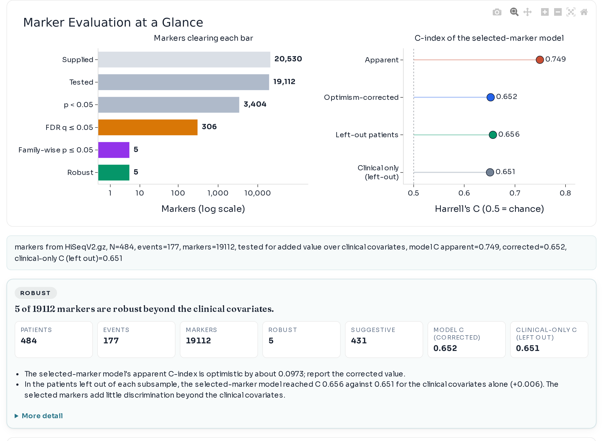
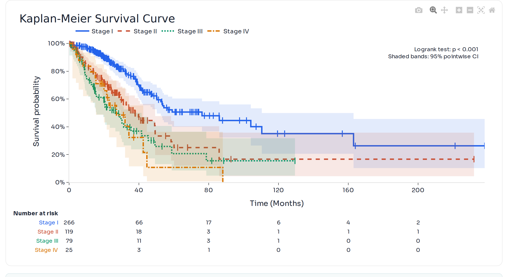
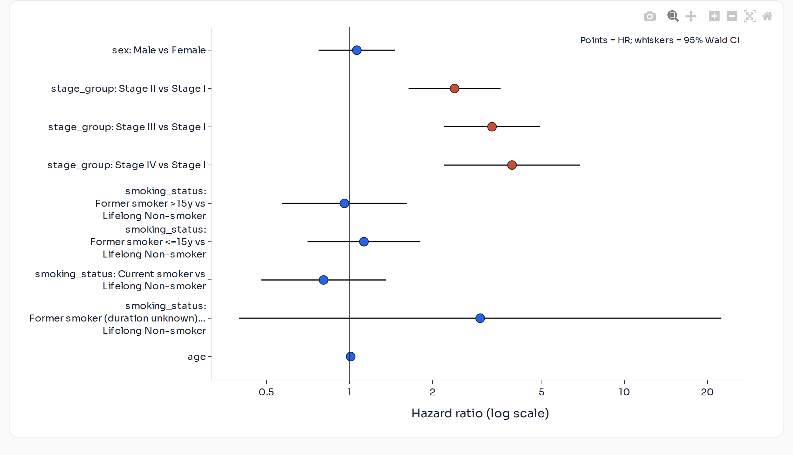
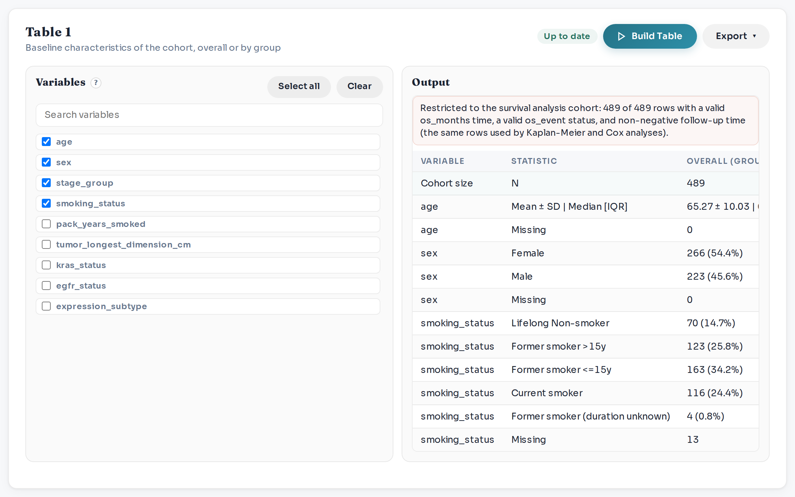
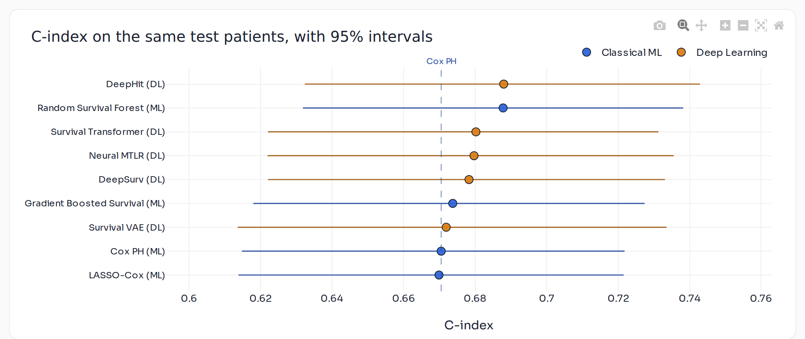
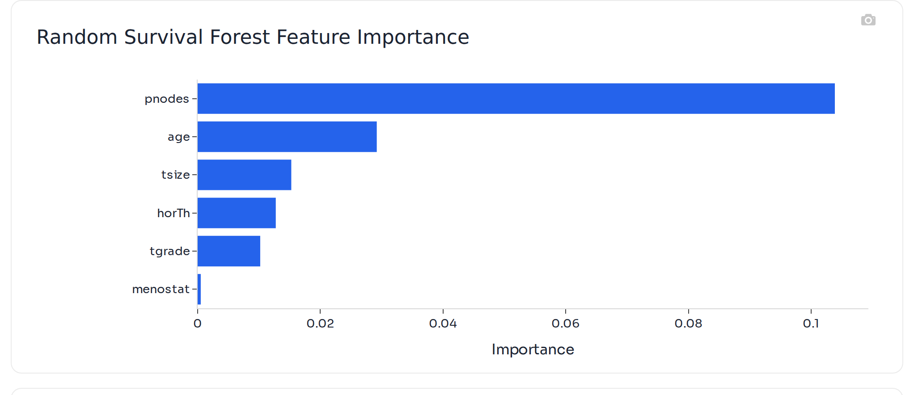
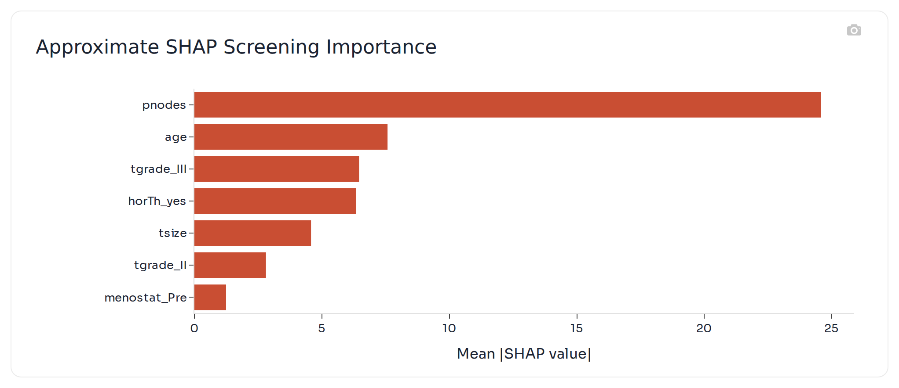

# Screenshots

[Back to quick start](../README.md)

These screenshots show the main report-facing workflows.

<table>
  <tr>
    <td width="50%">
      
       
      <strong>Start</strong> 
      Upload a cohort or open a sample; sample cohorts open with recommended settings.
    </td>
    <td width="50%">
      
       
      <strong>Marker evaluation</strong> 
      Which candidate markers hold up after error control, resampling and adjustment for clinical covariates.
    </td>
  </tr>
  <tr>
    <td width="50%">
      
       
      <strong>Survival curves</strong> 
      Kaplan-Meier curves, weighted log-rank testing, and report figure export.
    </td>
    <td width="50%">
      
       
      <strong>Cox model</strong> 
      Hazard-ratio forest plots, proportional-hazards diagnostics, and stratified Cox support.
    </td>
  </tr>
  <tr>
    <td width="50%">
      
       
      <strong>Table 1</strong> 
      Baseline characteristics of the analysed patients, overall or by group.
    </td>
    <td width="50%">
      
       
      <strong>Prediction models</strong> 
      One board compares classical ML and deep-learning survival models on the same patient splits.
    </td>
  </tr>
  <tr>
    <td width="50%">
      
       
      <strong>Feature importance</strong> 
      Permutation importance of a trained model, shown in the model workbench.
    </td>
    <td width="50%">
      
       
      <strong>SHAP explanations</strong> 
      Companion-model SHAP support is available for screened tree models when the encoded feature matrix allows it.
    </td>
  </tr>
</table>

