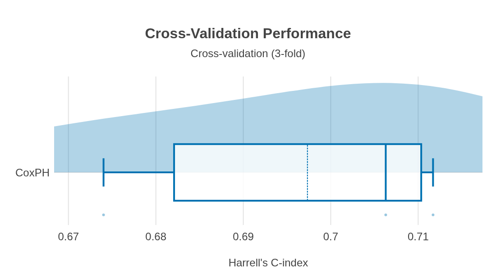
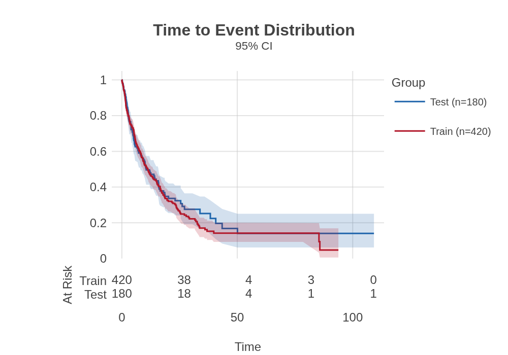
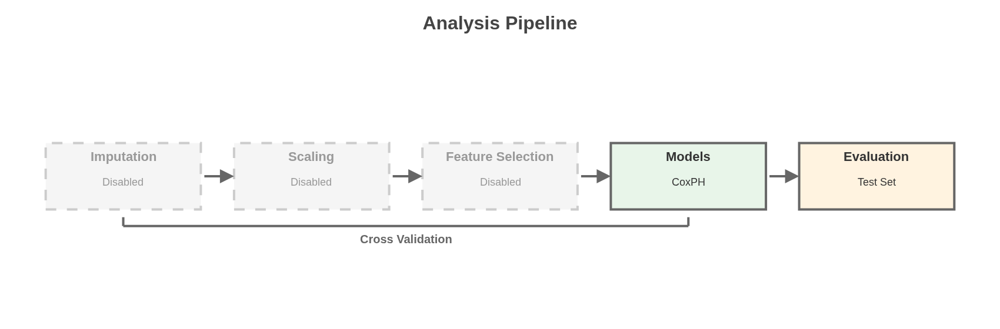
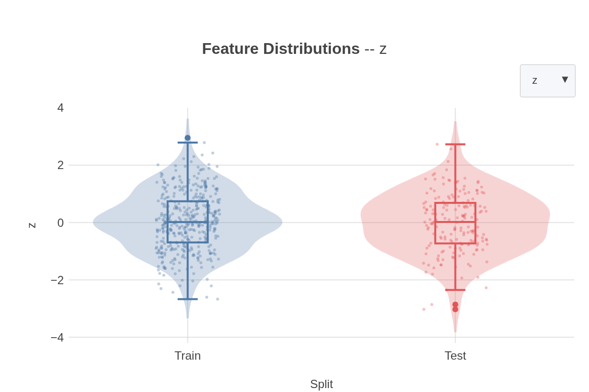
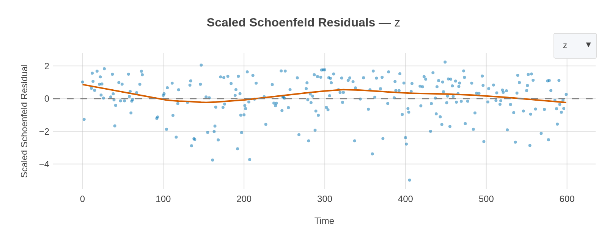
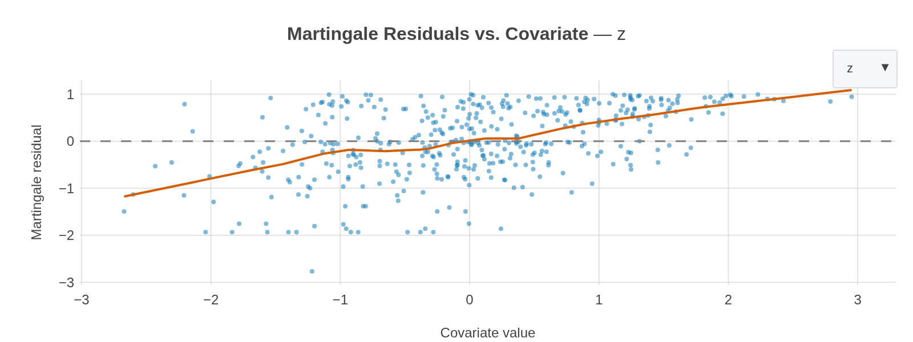
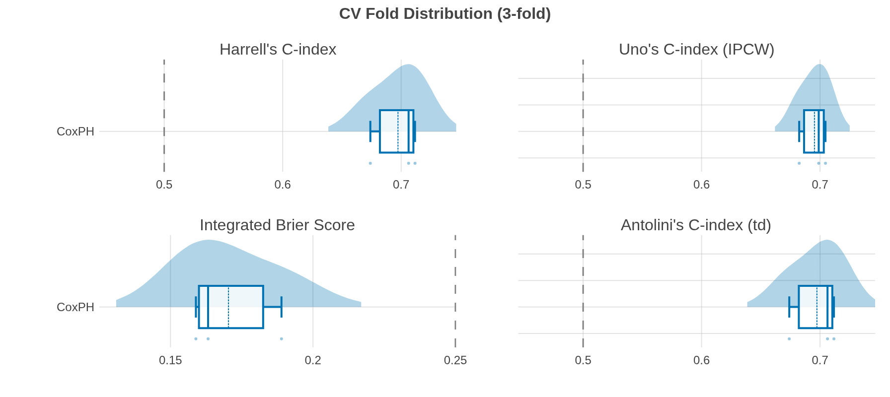

\newpage

## Executive Summary

> **Key Findings**
>
> - **Best model:** *CoxPH* (3-fold stratified cross-validation mean Harrell's C-index = *0.697* ± 0.020)
> - **Sample size:** 600 observations (345 events, 43% censored)

This analysis using *CoxPH* on *600* observations (*420* training [70%], *180* test [30%]; *2* features; event rate *57.5%*) using 3-fold stratified cross-validation. *CoxPH* achieved the best 3-fold stratified cross-validation mean Harrell's C-index of *0.697*, correctly ranking risk in 70% of comparable pairs (moderate discrimination).

**1 limitation flagged:** No External Validation. See *Limitations & Caveats* for details.

{#fig:cv_raincloud}

\newpage

## Data & Preprocessing

This section summarizes the dataset characteristics and preprocessing pipeline used in this survival analysis.

**Contents:**

1. [Dataset Overview](#dataset-overview)
2. [Model Recommendations](#model-recommendations)
3. [Missing Data](#missing-data)
4. [Pipeline Configuration](#pipeline-configuration)
5. [Analysis Pipeline](#analysis-pipeline)
6. [Feature Summary](#feature-summary)
7. [Feature Distributions](#feature-distributions)
8. [Proportional Hazards Assessment](#proportional-hazards-assessment)
9. [Linearity Assumption Assessment](#linearity-assumption-assessment)

### Dataset Overview

| Metric                    | Value        |
|:--------------------------|:-------------|
| Total cohort size         | 600          |
| Training samples          | 420          |
| Test samples              | 180          |
| Test fraction             | 30.0%        |
| Training events           | 241 (57.4%)  |
| Test events               | 104 (57.8%)  |
| Censored (training)       | 179 (42.6%)  |
| Censored (test)           | 76 (42.2%)   |
| Survival time (min)       | 0.0          |
| Survival time (median)    | 6.3          |
| Survival time (max)       | 109.2        |
| Number of features        | 2            |
| Split stratification      | Event status |
| Events per variable (EPV) | 120.5        |

{#fig:overall_km}

### Model Recommendations

*N=420, events=241, features=2, EPV=120.5*

| Model       | Sample size          | EPV               | PH     | Linearity | Recommendation |
|-------------|----------------------|-------------------|--------|-----------|----------------|
| CoxPH       | —  N=420             | ✓  EPV=120.5 ≥ 20 | ✓  OK  | ✓  OK     | ✓  Recommended |
| CoxNet      | —  N=420             | ✓  EPV=120.5 ≥ 20 | ✓  OK  | ✓  OK     | ✓  Recommended |
| FSSVM       | —  N=420             | ✓  EPV=120.5 ≥ 20 | —  N/A | —  N/A    | ✓  Recommended |
| Weibull-AFT | —  N=420             | ✓  EPV=120.5 ≥ 20 | ✓  OK  | ✓  OK     | ✓  Recommended |
| RSF         | ⚠  200 ≤ N=420 < 500 | ✓  EPV=120.5 ≥ 50 | —  N/A | —  N/A    | ⚠  Cautionary  |
| GBSA        | ⚠  200 ≤ N=420 < 500 | ✓  EPV=120.5 ≥ 50 | ✓  OK  | —  N/A    | ⚠  Cautionary  |
| XGBoost-Cox | ⚠  200 ≤ N=420 < 500 | ✓  EPV=120.5 ≥ 50 | ✓  OK  | —  N/A    | ⚠  Cautionary  |
| XGBoost-AFT | ⚠  200 ≤ N=420 < 500 | ✓  EPV=120.5 ≥ 50 | —  N/A | —  N/A    | ⚠  Cautionary  |

PH test: all 2 features satisfy proportional hazards (Grambsch-Therneau, BH-FDR p ≥ 0.05).

Linearity test: all 2 continuous features pass log-hazard linearity (Harrell/rms Wald, BH-FDR p ≥ 0.05).

Column legend: ✓ pass, ⚠ marginal, ✗ fail, — not applicable, ? not tested. EPV thresholds: ≥10 conventional (Peduzzi 1995); ≥50 stricter (Riley 2019). Lower EPV penalises Cox-family models toward *cautionary* / *not recommended*.

### Missing Data

No missing values detected in the dataset.

### Pipeline Configuration

| Step     | Initial Parameters   | Parameter Search Spaces for Tuning   |
|:---------|:---------------------|:-------------------------------------|
| Scaler   | Not configured       | -                                    |
| Imputer  | Not configured       | -                                    |
| Selector | Not configured       | -                                    |
| CoxPH    | CoxPHModel           | -                                    |

### Analysis Pipeline

The flowchart below illustrates the data analysis pipeline used in this survival analysis.

{#fig:pipeline_flowchart}

### Feature Summary

| Variable   | Statistic         | Train (n=420)      | Test (n=180)       |
|:-----------|:------------------|:-------------------|:-------------------|
| m0         | Mean (SD)         | 1.04 (1.74)        | 1.04 (1.64)        |
| m0         | Median [min, max] | 0.84 [-2.12, 9.36] | 0.72 [-1.57, 9.47] |
| z          | Mean (SD)         | 0.04 (1.01)        | -0.01 (1.02)       |
| z          | Median [min, max] | 0.01 [-2.67, 2.95] | 0.02 [-3.03, 2.73] |

### Feature Distributions

Per-feature distribution plots comparing train and test splits. Use the dropdown to inspect individual features. Detected one-hot groups are shown as combined bar charts.

{#fig:feature_distributions}

### Proportional Hazards Assessment

These diagnostics test whether the covariates satisfy the proportional hazards (PH) assumption — a key requirement for Cox-family models. All residuals are computed from an internally re-fit CoxPH model.

**Schoenfeld residuals.** A Cox model assumes each covariate's effect — its *hazard ratio* (multiplicative effect on the instantaneous event rate) — stays constant over follow-up. This is the *proportional hazards* (PH) assumption. Schoenfeld residuals check it one covariate at a time: at every event time, take the covariate value of the patient who just had the event and subtract the hazard-weighted average covariate value among everyone still at risk. If the model is right, these residuals should scatter flat around zero over follow-up. A systematic upward or downward LOWESS trend means the covariate's effect is drifting — e.g., strong early and fading later — and the constant-hazard-ratio assumption does not hold for that feature. The residuals shown here are *scaled* so that the slope against time is directly interpretable as how much the effect is changing; the formal Grambsch-Therneau test below turns that slope into a p-value. Use the dropdown to inspect individual features.

{#fig:schoenfeld_residuals}

**Proportional Hazards Test (Grambsch-Therneau):** This test regresses scaled Schoenfeld residuals on time for each covariate. The null hypothesis is that the coefficient (hazard ratio) is constant over time. Per-feature p-values are FDR-corrected (Benjamini-Hochberg); significance is based on adjusted p < 0.05. Non-significant results support the PH assumption. Significant results indicate the covariate's effect changes over the follow-up period, which may warrant time-varying coefficients or stratification. The GLOBAL row tests the joint hypothesis across all covariates (not adjusted for multiplicity).

| Feature | Statistic | p-value | p-adj (BH) | Sig. |
|---------|-----------|---------|------------|------|
| z       | 2.733     | 0.098   | 0.197      | No   |
| GLOBAL  | 3.538     | 0.171   | —          | No   |
| m0      | 1.642     | 0.200   | 0.200      | No   |

### Linearity Assumption Assessment

These diagnostics test whether the log-hazard is linear in each continuous covariate — a Cox-family assumption distinct from (and equal in importance to) proportional hazards.  Violations produce biased coefficient estimates and miscalibrated risk predictions even when the PH assumption itself holds.

**Martingale residuals:** Null-model martingale residuals (observed events minus cumulative hazard, estimated from Nelson-Aalen; Therneau, Grambsch & Fleming 1990) plotted against each continuous covariate.  A **straight** LOWESS trend (of any slope) is consistent with a linear log-hazard effect for that covariate.  A **curved** pattern (U-shape, monotone curve, step, etc.) reveals the functional form of the covariate's effect on the hazard and indicates a violation of the linearity assumption.  Use the dropdown to inspect individual features.

{#fig:martingale_residuals}

**Log-Hazard Linearity Test (Harrell/rms Wald):** A single unpenalized Cox model is fit with 4-knot restricted-cubic-spline expansions for every continuous covariate (knot quantiles at 5/35/65/95%, matching Harrell 2015 Table 2.3). For each feature, the joint Wald chi-square on the non-linear spline terms tests whether the log-hazard deviates from linearity; with 4 knots the per-feature test has 2 degrees of freedom. Per-feature p-values are FDR-corrected (Benjamini & Hochberg 1995); significance is based on adjusted p < 0.05. Non-significant results support the linearity assumption. Significant results indicate the covariate enters the log-hazard non-linearly, suggesting a transformation (log, Box-Cox) or a flexible model (RSF, GBSA, DeepSurv). The GLOBAL row tests the joint non-linearity across all covariates (not adjusted for multiplicity).  Matches R's ``rms::anova.cph`` output (Harrell 2015 §5.5).

| Feature | Wald χ² | p-value | p-adj (BH) | Sig. |
|---------|---------|---------|------------|------|
| GLOBAL  | 9.048   | 0.060   | —          | No   |
| m0      | 4.949   | 0.084   | 0.168      | No   |
| z       | 3.555   | 0.169   | 0.169      | No   |

\newpage

## Model Development

This section covers cross-validation performance for 1 model, and trained model details.

**Contents:**

1. [Configuration](#configuration)
2. [Cross-Validation Performance](#cross-validation-performance)
3. [Trained Model Details](#trained-model-details)

### Configuration

| Parameter        | Value                                                        |
|:-----------------|:-------------------------------------------------------------|
| CV Strategy      | Stratified K-Fold (maintains event composition in each fold) |
| Number of Folds  | 3                                                            |
| CV Repeats       | 1                                                            |
| Total Splits     | 3                                                            |
| Scoring Metric   | Harrell's C-index                                            |
| Random State     | 2026100901                                                   |
| Tuning During CV | No                                                           |
| Stratification   | event                                                        |

**Stratified K-Fold:** Mean values are computed across *3* folds of the training data, where each fold maintains the same event composition as the full dataset. Standard deviations indicate model stability across different train/validation splits.

### Cross-Validation Performance

The table below shows baseline model performance with default parameters.

****About the evaluation metrics** (click to expand)**
- **Harrell's C-index.** Rank-based concordance: the fraction of comparable subject pairs whose predicted risk ordering agrees with the observed event ordering. **Not IPCW** — ignores the censoring distribution, so it is biased upward under heavy or informative censoring.
- **Uno's C-index.** Concordance reweighted by the inverse of the censoring survival function (IPCW). Unbiased under independent censoring; prefer over Harrell C when censoring is non-trivial.
- **Integrated Brier Score (IBS).** Time-averaged squared difference between the predicted survival probability S(t|x) and the event-free indicator I(T > t), integrated over a dense grid of event times within the censoring-stable window [t_min, tau]. Combines calibration and discrimination in a single probabilistic score (lower is better). The practical reference is the IBS of a covariate-free Kaplan-Meier prediction on the same window — a useful model should beat that baseline. **IPCW** — censored subjects are reweighted rather than dropped.
- **Antolini's C-index (time-dependent).** Concordance that compares predicted survival probabilities *at each subject's own event time* rather than a single marginal risk score (Antolini, Boracchi & Biganzoli 2005). Sensitive to models whose risk ordering varies over follow-up (e.g., DeepHit, discrete-time hazards). **Not IPCW** in its classical form — like Harrell's C, it can be biased under heavy censoring.

| Model   | Status   | Harrell C         | Uno C             | IBS *             | C td              |
|:--------|:---------|:------------------|:------------------|:------------------|:------------------|
| CoxPH   | Baseline | **0.697 (0.020)** | **0.695 (0.012)** | **0.170 (0.016)** | **0.697 (0.020)** |

*Values shown as mean (std). Lower is better for columns marked with an asterisk.*

{#fig:model_comparison_cv}

### Trained Model Details

#### CoxPH

**Convergence:** Model converged normally.

\newpage

## Limitations & Caveats

This section highlights computable limitations detected during the analysis pipeline.  Each flag describes **what was detected**, **why it matters**, and a **suggested action**.  These are automatically derived — study-specific limitations must be added by the researcher.

**Contents:**

1. [No External Validation](#no-external-validation)

### No External Validation

> **Warning:**
> ⚠ What was detected: No external validation cohort was provided.
>   Why it matters: Internal validation (train/test split, cross-validation) may overestimate model performance.  External validation on an independent cohort is the gold standard for assessing generalizability.
>   Suggested action: Validate the model on an independent dataset from a different institution or time period.  If unavailable, clearly state this limitation when reporting results.

\newpage

## Environment & Reproducibility

This section records the software environment and pipeline configuration used to generate this report, supporting reproducibility and reviewer verification.

**Contents:**

1. [Software Versions](#software-versions)
2. [Platform](#platform)
3. [Run Settings](#run-settings)
4. [Full Pipeline Configuration](#full-pipeline-configuration)

### Software Versions

| Package         | Version   |
|:----------------|:----------|
| mlsurv          | 0.2.0     |
| Python          | 3.12.3    |
| scikit-survival | 0.28.0    |
| optuna          | 5.0.0     |
| xgboost         | 3.4.1     |
| numpy           | 2.5.3     |
| pandas          | 3.0.6     |
| lifelines       | 0.30.0    |
| plotly          | 7.1.0     |
| scikit-learn    | 1.9.1     |

### Platform

| Property     | Value                                        |
|:-------------|:---------------------------------------------|
| Platform     | Linux-7.0.0-34-generic-x86_64-with-glibc2.39 |
| Architecture | x86_64                                       |
| CPU count    | 24                                           |

### Reproducibility

| Property    | Value      |
|:------------|:-----------|
| Random Seed | 2026100901 |

### Run Settings

| Model   | Tuned   | n_trials   | n_bootstrap   | Calibrated   | Cal. method   | Cal. horizons   |
|:--------|:--------|:-----------|:--------------|:-------------|:--------------|:----------------|
| coxph   | False   | -          | -             | False        | -             | -               |

### Full Pipeline Configuration

**Full configuration dump (click to expand)**
**Data**

| Setting | Value |
|---------|-------|
| n_train | `420` |
| n_test | `180` |
| n_features | `2` |
| n_events_train | `241` |

**Cross-Validation**

| Setting | Value |
|---------|-------|
| cv_folds | `3` |
| cv_repeats | `1` |
| cv_ci | `0.95` |
| cv_strategy | `stratifiedkfold` |
| stratify | `event` |
| groups | `none` |

**Reproducibility**

| Setting | Value |
|---------|-------|
| random_state | `2026100901` |
| n_jobs | `1` |
| presplit | `False` |

**Tuning**

| Setting | Value |
|---------|-------|
| tuned_models | `[]` |
| experiment_name | `None` |

**Evaluation**

| Setting | Value |
|---------|-------|
| test_fraction | `0.3` |
| scoring | `harrell` |
| device | `None` |
| time_unit | `None` |
| outcome_name | `event` |

**Diagnostics**

| Setting | Value |
|---------|-------|
| check_leakage | `True` |
| ph_test | `True` |
| linearity_test | `True` |

**Subpopulations**

| Setting | Value |
|---------|-------|
| stratify_subpopulations | `True` |
| subpopulations_declared | `False` |
| categorical_groups_declared | `False` |
| feature_groups_declared | `False` |

**Other**

| Setting | Value |
|---------|-------|
| report_eval_times | `[]` |
| categorical_features_declared | `False` |

*Report generated: 2026-10-09 00:39:59 UTC*

\newpage

## References

### Acknowledgments

mlsurv is built on a foundation of established open-source libraries.

**scikit-survival** provides the foundational survival analysis models and metrics that power mlsurv's core functionality. Its scikit-learn-compatible design influenced our model interface, enabling seamless integration with existing machine learning workflows.

**lifelines** powers Kaplan-Meier estimation, log-rank tests, and Cox regression diagnostics, providing robust non-parametric and semi-parametric survival analysis capabilities.

**scikit-learn** shapes mlsurv's interface through its Pipeline, BaseEstimator, and cross-validation abstractions, enabling consistent model composition and evaluation patterns.

**Optuna** enables mlsurv's intelligent hyperparameter optimization through its efficient tree-structured Parzen estimator algorithm.

PyCaret's low-code philosophy inspired mlsurv's user-friendly interface design.

mlsurv also relies on **NumPy**, **pandas**, and **Plotly** as core runtime dependencies.

We thank the developers and contributors of these projects.

---

### Citing mlsurv

If you use mlsurv in your research, please cite:

Goecks Lab at Moffitt Cancer Center. (2026). *mlsurv: Low-Code Survival Machine Learning in Python* [Computer software]. https://github.com/goeckslab/mlsurv

---

### Bibliography

#### Model References

Cox, D. R. (1972). Regression models and life-tables. *Journal of the Royal Statistical Society: Series B*, 34(2), 187-202. <https://doi.org/10.1111/j.2517-6161.1972.tb00899.x>

#### Reporting Guidelines

Collins, G. S., et al. (2024). TRIPOD+AI statement: Updated guidance for reporting clinical prediction models that use regression or machine learning methods. *BMJ*, 385, e078378. <https://doi.org/10.1136/bmj-2023-078378>

#### Software References

Akiba, T., Sano, S., Yanase, T., Ohta, T., & Koyama, M. (2019). Optuna: A next-generation hyperparameter optimization framework. In *Proceedings of the 25th ACM SIGKDD International Conference on Knowledge Discovery & Data Mining* (pp. 2623-2631). <https://doi.org/10.1145/3292500.3330701>

Davidson-Pilon, C. (2019). lifelines: Survival analysis in Python. *Journal of Open Source Software*, 4(40), 1317. <https://doi.org/10.21105/joss.01317>

Polsterl, S. (2020). scikit-survival: A library for time-to-event analysis built on top of scikit-learn. *Journal of Machine Learning Research*, 21(212), 1-6. <https://jmlr.org/papers/v21/20-729.html>

---

*Report generated with mlsurv*

\newpage

## TRIPOD+AI Checklist

This appendix maps the TRIPOD+AI reporting checklist (Collins et al., BMJ 2024) against this report. Each item shows its coverage status and where to find the information — either auto-filled from the analysis or flagged for the researcher to provide.

**Status key:**

- **Auto** — Value or section reference provided by mlsurv
- **Scaffold** — Placeholder with guidance; researcher completes for manuscript
- **Researcher** — Outside mlsurv scope; researcher provides for manuscript
- **N/A** — Not applicable to this analysis

**Coverage summary:** 
Auto: 18 | Scaffold: 10 | Researcher: 22 | N/A: 2

### Title & Abstract

| Item   | Requirement                                     | Status     | Reference / Value                               |
|:-------|:------------------------------------------------|:-----------|:------------------------------------------------|
| 1      | Identify study type, target population, outcome | Researcher | Provide in manuscript title                     |
| 2      | Structured abstract                             | Scaffold   | Adapt Executive Summary for manuscript abstract |

### Introduction

| Item   | Requirement                                         | Status     | Reference / Value                                 |
|:-------|:----------------------------------------------------|:-----------|:--------------------------------------------------|
| 3a     | Healthcare context, rationale, existing models      | Researcher | Provide clinical background                       |
| 3b     | Target population, intended purpose, intended users | Researcher | Provide study context                             |
| 3c     | Known health inequalities                           | Researcher | Provide equity considerations                     |
| 4      | Study objectives (development vs. validation)       | Scaffold   | See Executive Summary — adapt objective statement |

### Methods — Data

| Item   | Requirement                                 | Status     | Reference / Value        |
|:-------|:--------------------------------------------|:-----------|:-------------------------|
| 5a     | Data sources, rationale, representativeness | Researcher | Describe data provenance |
| 5b     | Dates of participant data                   | Researcher | Provide collection dates |

### Methods — Participants

| Item   | Requirement          | Status     | Reference / Value                     |
|:-------|:---------------------|:-----------|:--------------------------------------|
| 6a     | Study setting        | Researcher | Describe clinical setting             |
| 6b     | Eligibility criteria | Researcher | Describe inclusion/exclusion criteria |
| 6c     | Treatment details    | Researcher | Describe treatments received          |

### Methods — Data Preparation

| Item   | Requirement                             | Status   | Reference / Value        |
|:-------|:----------------------------------------|:---------|:-------------------------|
| 7      | Data preprocessing and quality checking | Auto     | See Data & Preprocessing |

### Methods — Outcome

| Item   | Requirement                         | Status     | Reference / Value                                          |
|:-------|:------------------------------------|:-----------|:-----------------------------------------------------------|
| 8a     | Outcome definition and time horizon | Scaffold   | See Data & Preprocessing — add clinical outcome definition |
| 8b     | Outcome assessor qualifications     | Researcher | Describe assessment procedures                             |
| 8c     | Blinding of outcome assessment      | Researcher | Describe blinding procedures                               |

### Methods — Predictors

| Item   | Requirement                                           | Status     | Reference / Value                               |
|:-------|:------------------------------------------------------|:-----------|:------------------------------------------------|
| 9a     | Choice of initial predictors, pre-selection rationale | Scaffold   | See Feature Analysis — add selection rationale  |
| 9b     | Predictor definitions and measurement                 | Scaffold   | See Feature Analysis — add clinical definitions |
| 9c     | Predictor assessor qualifications                     | Researcher | Describe measurement procedures                 |

### Methods — Sample Size

| Item   | Requirement               | Status   | Reference / Value                                               |
|:-------|:--------------------------|:---------|:----------------------------------------------------------------|
| 10     | Sample size justification | Auto     | EPV = 120.5 (241 events / 2 features). See Data & Preprocessing |

### Methods — Missing Data

| Item   | Requirement           | Status   | Reference / Value        |
|:-------|:----------------------|:---------|:-------------------------|
| 11     | Missing data handling | Auto     | See Data & Preprocessing |

### Methods — Analytical Methods

| Item   | Requirement                                             | Status   | Reference / Value                                                |
|:-------|:--------------------------------------------------------|:---------|:-----------------------------------------------------------------|
| 12a    | Data partitioning strategy                              | Auto     | 70% / 30% train/test split (420 / 180). See Data & Preprocessing |
| 12b    | Predictor handling (rescaling, transformation)          | Auto     | See Data & Preprocessing                                         |
| 12c    | Model type, building steps, tuning, internal validation | Auto     | See Model Development + Feature Analysis (SHAP, importance)      |
| 12d    | Heterogeneity across clusters                           | Scaffold | Use subpopulation analysis to evaluate per-site performance      |
| 12e    | Performance measures and plots with rationale           | Auto     | See Model Evaluation                                             |
| 12f    | Model updating / recalibration                          | N/A      | Not applicable to current analysis                               |
| 12g    | How predictions were calculated                         | Auto     | See Environment & Reproducibility                                |

### Methods — Imbalance, Fairness, Output

| Item   | Requirement                          | Status   | Reference / Value                                                                     |
|:-------|:-------------------------------------|:---------|:--------------------------------------------------------------------------------------|
| 13     | Class imbalance handling (censoring) | Auto     | Censoring rate: 42.6% (179 censored / 420 training samples). See Data & Preprocessing |
| 14     | Fairness approaches                  | Scaffold | See Subpopulation Analysis for per-group discrimination and calibration metrics       |
| 15     | Model output specification           | Auto     | See Model Evaluation — risk scores                                                    |

### Methods — Dev vs. Eval, Ethics

| Item   | Requirement                           | Status     | Reference / Value                   |
|:-------|:--------------------------------------|:-----------|:------------------------------------|
| 16     | Differences between dev and eval data | Auto       | No external validation performed    |
| 17     | Ethical approval                      | Researcher | Provide IRB/ethics approval details |

### Open Science

| Item   | Requirement           | Status     | Reference / Value                  |
|:-------|:----------------------|:-----------|:-----------------------------------|
| 18a    | Funding               | Researcher | Provide funding sources            |
| 18b    | Conflicts of interest | Researcher | Declare conflicts of interest      |
| 18c    | Protocol access       | Researcher | Provide protocol availability      |
| 18d    | Registration          | Researcher | Provide study registration details |
| 18e    | Data sharing          | Researcher | Describe data availability         |
| 18f    | Code sharing          | Auto       | See Environment & Reproducibility  |

### Patient & Public Involvement

| Item   | Requirement                    | Status     | Reference / Value       |
|:-------|:-------------------------------|:-----------|:------------------------|
| 19     | Patient and public involvement | Researcher | Describe PPI activities |

### Results

| Item   | Requirement                                  | Status   | Reference / Value                                                               |
|:-------|:---------------------------------------------|:---------|:--------------------------------------------------------------------------------|
| 20a    | Participant flow (N, events, follow-up)      | Auto     | N = 600, events = 345 (rate 57.5%). See Data & Preprocessing                    |
| 20b    | Participant characteristics table            | Auto     | See Data & Preprocessing                                                        |
| 20c    | Dev vs. eval data comparison                 | Auto     | No external validation performed                                                |
| 21     | N participants and events per analysis phase | Auto     | Train: 420 (241 events), Test: 180 (104 events). See Data & Preprocessing       |
| 22     | Full model specification                     | Auto     | See Model Development (parameters) and Environment & Reproducibility (pipeline) |
| 23a    | Performance with CIs, subpopulation results  | Auto     | See Model Evaluation                                                            |
| 23b    | Heterogeneity across clusters                | Scaffold | Use subpopulation analysis to evaluate per-site performance                     |
| 24     | Model updating results                       | N/A      | Not applicable to current analysis                                              |

### Discussion

| Item   | Requirement                            | Status     | Reference / Value                                          |
|:-------|:---------------------------------------|:-----------|:-----------------------------------------------------------|
| 25     | Overall interpretation                 | Scaffold   | See Executive Summary — expand with clinical context       |
| 26     | Limitations                            | Scaffold   | See Limitations & Caveats — add study-specific limitations |
| 27a    | Handling poor input data at deployment | Researcher | Describe deployment data quality plans                     |
| 27b    | User expertise requirements            | Researcher | Describe intended user qualifications                      |
| 27c    | Next steps, generalizability           | Researcher | Discuss external applicability                             |

---
*Generated by mlsurv*